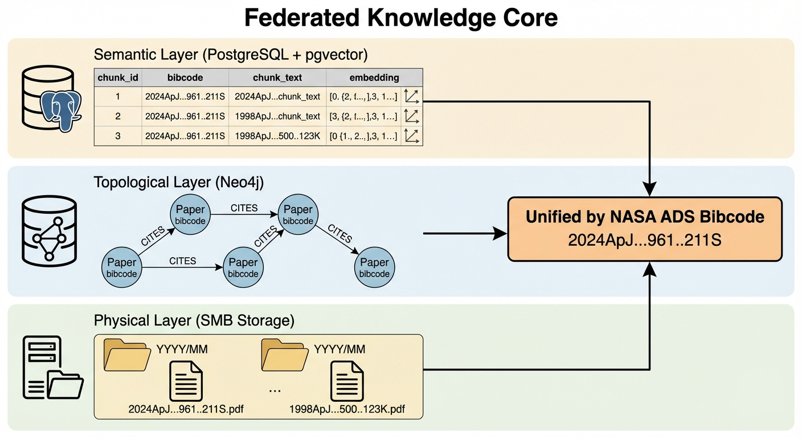
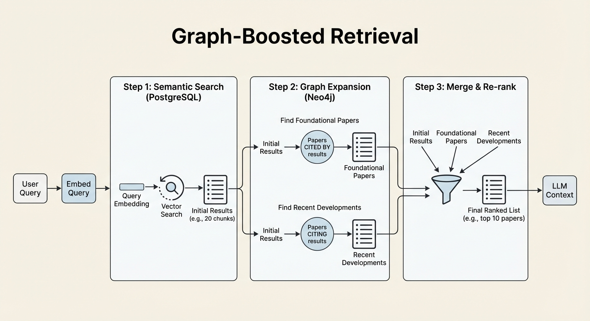

I'm building a RAG system for astronomical research papers. The naive approach - chunk papers, embed them, do similarity search - fails in ways that reveal something important about how scientific knowledge actually works.

The problem: a foundational 1998 paper on galaxy quenching mechanisms shares almost no vocabulary with a 2024 paper about DESI survey results. Semantic similarity search won't surface it. But that 1998 paper is cited by 47 papers in my corpus, including three that directly inform the 2024 work. The citation graph knows it's important. The embeddings don't.

This led me to a different architecture: separate databases for *what papers say* versus *how papers relate*.

## The Failure Mode

This is what a traditional RAG pipeline might look like.

1. Chunk documents into ~500 token segments
2. Embed each chunk into vector space
3. Query: embed the question, find nearest neighbor chunks
4. Feed retrieved chunks to the LLM as context

This works great for corporate documentation, product manuals, legal contracts - domains where relevant documents use similar vocabulary to the query.

But, me as a researcher asking "What mechanisms drive star formation suppression in DESI void galaxies?" needs context from:

- Recent DESI papers (high semantic similarity - they use the same terms)
- Foundational quenching physics papers from 2000-2010 (low semantic similarity - different vocabulary, different surveys, but essential physics)
- Methodological papers on void identification algorithms (moderate similarity - technical overlap but different focus)

Semantic search alone returns the DESI papers and misses the foundational physics. The LLM generates plausible-sounding answers without the theoretical grounding that makes them scientifically valid. AI slop that has no real foundation in reality and therefore is wholly unsuitable for scientific work.

## The Federated Knowledge Core

The solution: two databases, two retrieval paths, unified by a common identifier (the NASA ADS Bibcode) - a unique 19-character string assigned to every paper in the astrophysics literature, like '2024ApJ...961..211S'. This handles *what the paper is about*.



PostgreSQL + pgvector: The Semantic Layer

This handles *what papers say*. Chunked text with embeddings, enabling similarity search. When the query mentions "DESI" and "void galaxies," this layer surfaces papers that discuss those specific terms.

```sql
-- Semantic search: find chunks similar to query embedding
SELECT chunk_id, bibcode, chunk_text, 
       1 - (embedding <=> query_embedding) AS similarity
FROM paper_chunks
ORDER BY embedding <=> query_embedding
LIMIT 20;
```

Neo4j: The Topological Layer

This handles *how papers relate*. Citation networks, co-authorship graphs, shared concepts. When the semantic layer returns a set of papers, the topological layer expands that set by traversing relationships.

```cypher
// Find foundational papers: highly cited by our semantic results
MATCH (p:Paper)-[:CITES]->(foundation:Paper)
WHERE p.bibcode IN $semantic_results
WITH foundation, COUNT(p) AS citation_count
WHERE citation_count >= 3
RETURN foundation.bibcode, foundation.title, citation_count
ORDER BY citation_count DESC
```

SMB Storage: The Physical Layer

The actual PDFs and LaTeX source files, organized by publication date and bibcode. Every chunk in PostgreSQL, every node in Neo4j, references a physical file path. The LLM can cite sources because we can trace every claim back to a document.

## Graph-Boosted Retrieval

The magic happens when you combine both retrieval paths:

1. Semantic search returns the 20 most similar chunks to the query
2. Graph expansion finds papers highly cited by the semantic results (foundational works) and papers that cite the semantic results (recent developments)
3. Merge and re-rank combines both sets, weights by a combination of semantic similarity and citation importance



```python
def hybrid_retrieve(query: str, k: int = 10) -> list[Paper]:
    # Step 1: Semantic search
    query_embedding = embed(query)
    semantic_results = pg_search(query_embedding, limit=20)
    
    # Step 2: Graph expansion
    bibcodes = [r.bibcode for r in semantic_results]
    
    # Find foundational papers (cited by multiple semantic hits)
    foundations = neo4j_query("""
        MATCH (p:Paper)-[:CITES]->(f:Paper)
        WHERE p.bibcode IN $bibcodes
        WITH f, COUNT(p) AS cite_count
        WHERE cite_count >= 2
        RETURN f.bibcode, cite_count
    """, bibcodes=bibcodes)
    
    # Find recent developments (papers citing semantic hits)
    developments = neo4j_query("""
        MATCH (d:Paper)-[:CITES]->(p:Paper)
        WHERE p.bibcode IN $bibcodes
        AND d.year >= 2022
        RETURN d.bibcode, COUNT(p) AS relevance
    """, bibcodes=bibcodes)
    
    # Step 3: Merge and re-rank
    all_papers = merge_results(semantic_results, foundations, developments)
    return rerank(all_papers, query)[:k]
```

Now we see that the foundational 1998 quenching paper surfaces - not because it matches the query vocabulary, but because it's cited by 5 of the 20 semantic results. The graph knows what the embeddings don't.

## Why Two Databases Instead of One?

You could store everything in PostgreSQL - add citation relationships as foreign keys, query with JOINs. Or store everything in Neo4j - it supports vector indexes now. Why the complexity of two systems?

Specialization matters at scale.

PostgreSQL with pgvector is optimized for high-dimensional similarity search. HNSW indexes, approximate nearest neighbors, efficient batch operations. It handles millions of chunks without breaking a sweat.

Neo4j is optimized for graph traversal. Finding papers 2-3 citation hops away, identifying clusters, computing centrality metrics. A citation graph with millions of edges needs a database designed for that access pattern.

Using both means each system does what it's best at. The overhead of maintaining two databases is lower than the performance cost of forcing one system to do both jobs poorly.

The join point is clean.

Every paper has a unique identifier (bibcode). PostgreSQL stores `bibcode` as a column. Neo4j stores `bibcode` as a node property. Merging results is a simple set operation on identifiers. No complex foreign key relationships spanning systems.

## The Corpus Scale

For my DESI research focus, the corpus includes:

- ~2,000 papers directly relevant to void galaxy evolution
- ~15,000 papers in the extended citation network
- ~500,000 chunks after processing
- ~3M citation relationships in Neo4j

Storage footprint:

- PostgreSQL (with embeddings): ~25 GB
- Neo4j (graph only): ~2 GB  
- PDFs on SMB: ~50 GB

This runs comfortably on a single Proxmox node. No cloud required, no Kubernetes complexity. The architecture scales to much larger corpora, but for domain-specific research, you don't need hyperscaler infrastructure.

## What This Enables

With the federated architecture in place, queries become research-grade:

"What's the current consensus on AGN feedback in cluster environments?"

- Semantic search finds recent review papers and observational studies
- Graph expansion surfaces the theoretical frameworks they're all building on
- The LLM synthesizes with actual citations to foundational work

"Find papers that challenge the standard quenching timeline"

- Semantic search finds papers mentioning "quenching" and "timeline"
- Graph analysis identifies papers cited as counterarguments (negative citation sentiment, where available)
- Results include contrarian perspectives the LLM wouldn't hallucinate

"Who are the key researchers connecting DESI observations to quenching theory?"

- Pure graph query: find authors who bridge the two subgraphs
- No semantic search needed - this is structural, not textual

## The Pattern Generalizes

Astronomy is my domain, but the architecture applies anywhere scientific literature matters:

- Medical research: Papers share methodology but different disease vocabulary
- Legal research: Case law citations form a graph; precedent matters more than keyword matching
- Patent analysis: Citation networks reveal technology lineages that semantic search misses

Any domain where *relationships between documents* carry information beyond *content of documents* benefits from this hybrid approach.

Traditional RAG asks: "What documents say things similar to my query?"

Graph-boosted RAG asks: "What documents are important to the community of documents relevant to my query?"

That's a fundamentally different question, and for scientific research, it's the right one.

---

*Stack: PostgreSQL 16 with pgvector, Neo4j 5.x, Python with LangChain/LangGraph for orchestration. Full architecture designed for on-premise Proxmox deployment with SMB storage.*
