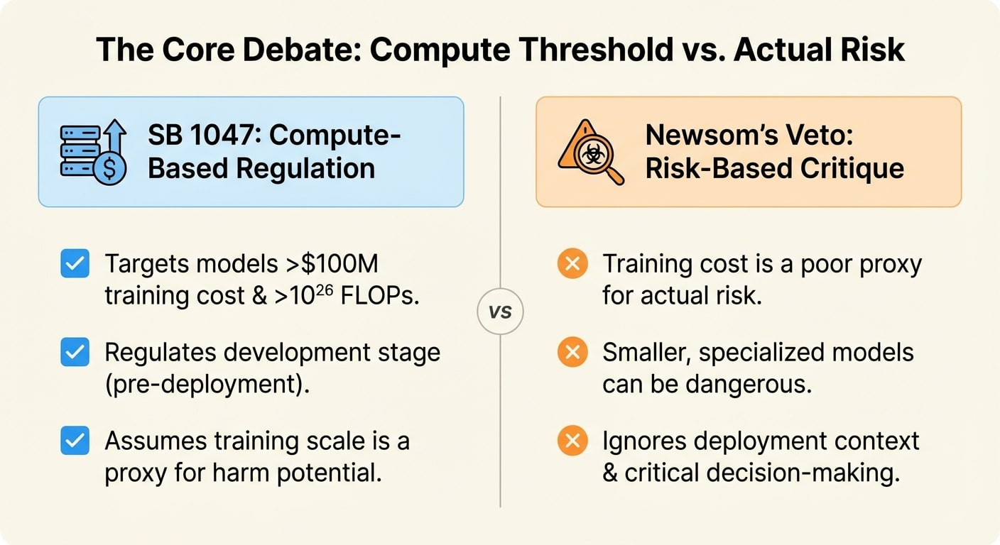

On September 29, 2024, California Governor Gavin Newsom [vetoed SB 1047](https://www.gov.ca.gov/wp-content/uploads/2024/09/SB-1047-Veto-Message.pdf), the Safe and Secure Innovation for Frontier Artificial Intelligence Models Act. The bill had passed both houses of the legislature with strong margins. It had support from 113 current and former AI company employees. Anthropic called it "substantially improved" after amendments.

Newsom killed it anyway, and in my opinion, his reasoning matters and reveals more than the veto itself.

## What SB 1047 Tried to Do

Unlike Colorado's [duty of care framework](/p/colorado-sb-24-205-duty-of-care/) or Texas's [intent-based restrictions](/p/texas-traiga-intent-based-model/), SB 1047 targeted a specific slice of AI: frontier models. The bill defined these as models trained using more than 10²⁶ floating-point operations and costing over $100 million to develop.

The requirements for developers of covered models:

- Implement safety and security protocols before training
- Conduct pre-deployment testing for "critical harms" (CBRN weapons, cyberattacks on critical infrastructure, mass casualty events)
- Maintain ability to shut down model instances (the "kill switch")
- Submit annual third-party compliance audits
- Report safety incidents to the Attorney General within 72 hours

This was development-stage regulation. The theory: the biggest, most capable models pose catastrophic risks that justify intervention before deployment, not after harm occurs.

## Why Newsom Vetoed It

Newsom's [veto message](https://www.gov.ca.gov/wp-content/uploads/2024/09/SB-1047-Veto-Message.pdf) made a specific argument: the bill regulates based on compute cost, not actual risk.

> "By focusing only on the most expensive and large-scale models, SB 1047 establishes a regulatory framework that could give the public a false sense of security about controlling this fast-moving technology. Smaller, specialized models may emerge as equally or even more dangerous than the models targeted by SB 1047."

His point: a $100 million model used for weather prediction isn't dangerous. A $10 million model fine-tuned for bioweapon synthesis might be. Training cost is a poor proxy for harm potential.

Newsom also objected to applying the same standards regardless of deployment context:

> "The bill does not take into account whether an AI system is deployed in high-risk environments, involves critical decision-making, or the use of sensitive data."

A frontier model generating marketing copy faces the same requirements as one controlling critical infrastructure. That's a blunt instrument.

## The Industry Split

SB 1047 revealed unusual fault lines. The typical "tech vs. regulators" framing didn't hold.

Against: OpenAI, Google, Meta, and most industry associations argued the bill would hamper innovation, damage California's AI ecosystem, and push development elsewhere. They preferred federal regulation or narrower state measures.

Cautiously supportive: Anthropic, after significant amendments, said the bill's "benefits likely outweigh its costs" while noting remaining concerns. Elon Musk supported it outright.

Strongly supportive: 113 current and former employees from OpenAI, Google DeepMind, Anthropic, Meta, and xAI signed a letter urging Newsom to sign. Safety-focused researchers saw it as a reasonable first step.

The split wasn't industry vs. critics - it was within the AI industry itself, between those prioritizing deployment speed and those prioritizing safety infrastructure.

## What It Means

The compute-threshold approach is dead in the water for California, at least for now. Newsom committed to working with legislators on alternative frameworks, but the 2025 legislative session hasn't produced a successor bill.

The veto leaves a gap in the regulatory landscape:

- Colorado regulates high-risk AI based on consequential decisions (employment, credit, healthcare)
- Texas regulates AI based on prohibited purposes (intentional discrimination, manipulation)
- California regulates... nothing comprehensive, despite being home to most frontier AI development

Newsom's critique has merit - training cost isn't a perfect proxy for risk. But his veto didn't propose an alternative metric. "High-risk environments" and "critical decision-making" are the criteria Colorado already uses for a different category of AI.

The question SB 1047 raised remains unanswered: should frontier model development face any pre-deployment requirements, and if so, how do you define "frontier" without using compute thresholds?

Until someone answers that, the most powerful AI systems in the world are developed under less regulatory oversight than a new pharmaceutical or aircraft design.

---

*Full text of [SB 1047](https://leginfo.legislature.ca.gov/faces/billNavClient.xhtml?bill_id=202320240SB1047) and [Newsom's veto message](https://www.gov.ca.gov/wp-content/uploads/2024/09/SB-1047-Veto-Message.pdf) available online.*
