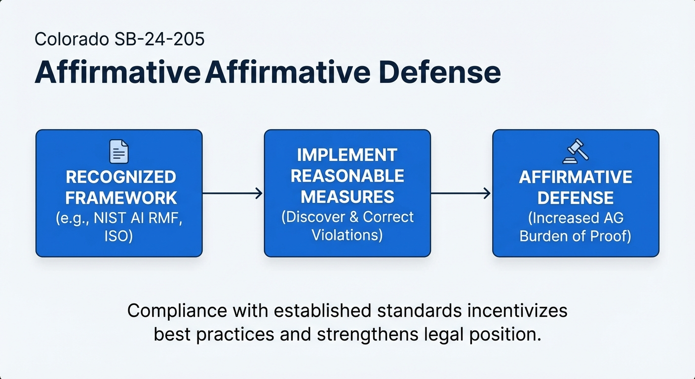

Colorado [SB-24-205](https://leg.colorado.gov/bills/sb24-205), signed May 17, 2024, establishes something novel in US AI regulation: a duty of care framework. Duty fo care is a legal obligation to exercise "reasonable care" to prevent algorithmic discrimination in high-stakes contexts.

This distinction matters because it survived the backlash. After a year of intense lobbying from tech industry groups, the law's implementation was [delayed to June 30, 2026](https://leg.colorado.gov/bills/sb25b-004), but the substantive framework remains unchanged. Governor Polis signed the delay "with reservations," explicitly hoping lawmakers would "significantly improve" the law before it takes effect, but no amendments passed during either the 2025 regular session or the August 2025 special session.

## What Duty of Care Actually Means

Traditional product liability law asks: "Did you exercise reasonable care?" Medical malpractice law asks: "Did you meet the standard of care?" Colorado applies the same framework to AI systems used in consequential decisions.

From [Section 6-1-1703](https://leg.colorado.gov/sites/default/files/2024a_205_signed.pdf):

> A developer shall use reasonable care to protect consumers from any known or reasonably foreseeable risks of algorithmic discrimination arising from the intended and contracted uses of the high-risk artificial intelligence system.

This isn't outcome liability - you're not strictly liable if your system produces a disparate impact. It's a process obligation - you must take reasonable steps to identify, document, and mitigate foreseeable risks.

For developers, this means:

- Provide documentation on intended uses, known limitations, and discrimination risks
- Make public statements about risk management measures
- Notify deployers of material changes that affect discrimination risks
- Supply technical documentation sufficient for deployers to conduct impact assessments

For deployers, this means:

- Implement a risk management policy based on recognized frameworks (NIST AI RMF, ISO standards)
- Complete impact assessments before deployment and annually thereafter
- Notify consumers when AI makes or substantially contributes to consequential decisions
- Review systems to ensure they're not causing algorithmic discrimination

The standard is "reasonable care" - calibrated to the size of the organization, complexity of the system, and sensitivity of the decisions. A startup deploying AI for employment screening has different obligations than a Fortune 500 company.

## High-Risk Systems and Consequential Decisions

The duty of care applies to "high-risk artificial intelligence systems" - any AI that makes, or is a substantial factor in making, consequential decisions about:

- Education enrollment or opportunities
- Employment or employment opportunities
- Essential government services
- Financial or lending services
- Health care services
- Housing opportunities
- Insurance services
- Legal services

"Consequential decision" means material legal effect on provision, denial, cost, or terms of these services. Not every AI interaction triggers the law - chatbots providing information don't count. But AI that screens resumes, approves loans, determines insurance premiums, or allocates government benefits does.

This scope is broad by design. The legislative intent was to cover any context where algorithmic discrimination could cause real harm, not to pick specific technologies or use cases.

## The Affirmative Defense

Section 6-1-1706 creates an affirmative defense: if you're in compliance with a recognized risk management framework and you take reasonable measures to discover and correct violations, the Attorney General's burden of proof increases substantially.

Recognized frameworks include:

- NIST AI Risk Management Framework
- ISO/IEC standards for AI systems
- Any framework the Attorney General designates

This is the "NIST AI RMF Cookbook" opportunity - if you can demonstrate rigorous adherence to established standards, you're in a much stronger legal position. The law incentivizes best practices rather than inventing Colorado-specific requirements.

## Why the Tech Industry Couldn't Kill It

Multiple attempts to substantially amend SB-24-205 failed:

- [SB 25-318](https://leg.colorado.gov/bills/sb25-318) (May 2025): Would have narrowed the definition of algorithmic discrimination to require violation of existing anti-discrimination law, exempted narrow procedural tasks, and delayed requirements to 2027. Sponsor killed his own bill after tech groups rejected the compromise.

- August 2025 special session: Senate Majority Leader Rodriguez negotiated a compromise with consumer groups, educators, labor, and business. Tech industry rejected it overnight. The only thing that passed was [SB 25B-004](https://leg.colorado.gov/bills/sb25b-004) - a pure delay with no substantive changes.

The duty of care framework survived because it's defensible. Asking companies to exercise "reasonable care" to prevent discrimination is harder to argue against than prescriptive technical mandates. The law doesn't ban specific technologies, doesn't require specific algorithms, doesn't pick winners and losers. It just says: if you're using AI to make decisions that affect people's lives, take reasonable steps to prevent discrimination.

That's a principles-based approach rather than a rules-based one, and it proved more resilient to lobbying.

## The Federal Tension

There's a complication: federal and state approaches are diverging.

Executive Order 14281 (January 2025) directs federal agencies to "eliminate the use of disparate-impact liability in all contexts" and de-prioritize enforcement of disparate-impact theories in civil rights law. Colorado SB-24-205 explicitly includes disparate-impact as algorithmic discrimination.

A company operating nationally now faces contradictory frameworks:

- Federal: Don't worry about disparate impact, focus on intentional discrimination
- Colorado: You have a duty of care to prevent foreseeable disparate impacts

This creates interesting compliance questions. Can you comply with both? Does federal law preempt Colorado's approach? These questions won't be resolved until the law actually goes into effect and someone gets sued.

## What Happens Next

The June 30, 2026 effective date gives the Colorado legislature one more chance to amend the law during the January-May 2026 session. Whether they'll reach consensus remains unclear - stakeholders have been debating for over a year without agreement.

If the law takes effect unchanged, Colorado becomes the test case for duty of care as a regulatory model for AI. Companies will need to implement risk management programs, conduct impact assessments, and document their reasonable care efforts. The Attorney General's office will need to determine what "reasonable care" actually looks like in practice.

The duty of care model survived a year of intense pressure. That suggests it might be the right framework - defensible enough to withstand lobbying, flexible enough to accommodate different contexts, principled enough to actually protect consumers from algorithmic discrimination.

We'll find out in June 2026 whether it works in practice.

---

*Full text of [Colorado SB-24-205](https://leg.colorado.gov/bills/sb24-205) and the [delay amendment SB 25B-004](https://leg.colorado.gov/bills/sb25b-004) available at the Colorado General Assembly website.*
