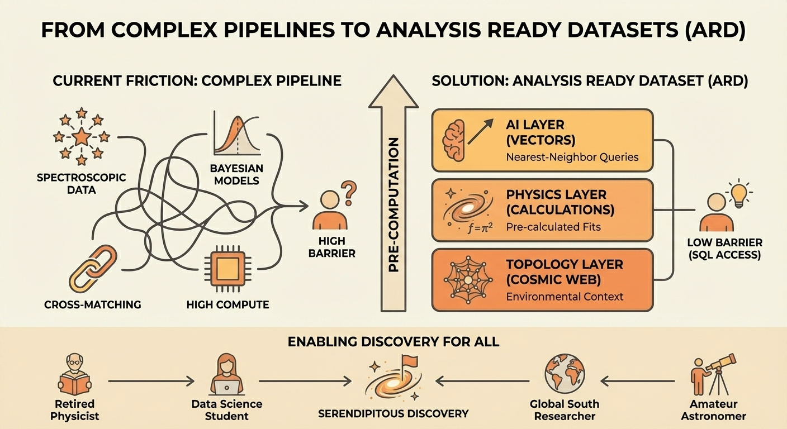

In 2007, a Dutch schoolteacher named Hanny van Arkel was classifying galaxies for Galaxy Zoo when she spotted something weird. A glowing green blob near a spiral galaxy that didn't match any category in the classification system.

She flagged it. Professional astronomers followed up. Turns out she'd discovered a "quasar light echo" - light from a quasar that died 200,000 years ago, still illuminating a gas cloud. An entirely new class of astronomical object, found by someone with no formal training, using publicly available data.

Hanny's Voorwerp isn't an isolated case. Galaxy Zoo citizen scientists also discovered "Green Pea" galaxies - compact, extremely star-forming systems that became crucial analogs for studying the early universe. These discoveries led to dedicated Hubble Space Telescope observations.

The pattern: democratize access to data, and discoveries come from unexpected places.

## The Current Friction

Galaxy Zoo worked because the task was accessible: look at an image, classify a shape. Humans are good at pattern recognition. The infrastructure requirement was a web browser.

But modern astronomical research isn't just image classification. Questions like "How does star formation vary across cosmic environments?" require:

- Spectroscopic data processing
- Bayesian model fitting
- Cross-matching multiple catalogs
- Graph analysis of large-scale structure
- Statistical inference on derived quantities

Each step requires specialized software, substantial compute, and domain expertise just to set up the pipeline. The brilliant schoolteacher can't participate because the barrier isn't scientific knowledge - it's infrastructure.

## The DESI Landscape

DESI Data Release 1 provides 6.4 million galaxy spectra. The data is public. Anyone can download it. But "public" doesn't mean "accessible."

The current Value Added Catalog (VAC) ecosystem includes:

DESIVAST (Voids): Provides void locations and geometry, but not galaxy properties within those voids. To study void galaxy evolution, you need to cross-match with other catalogs.

FastSpecFit: Provides emission line measurements and continuum fits. Essential, but not the derived physical quantities researchers actually need.

Stellar VAC: Radial velocities and atmospheric parameters for stars. Separate data model, separate access patterns.

Each VAC is valuable. But using them together requires understanding multiple data models, writing cross-match code, and running your own derived calculations. That's fine for professional astronomers with institutional support. It's a wall for everyone else.

## What Gets Lost

Here's what the current landscape misses:

The Retired Physicist: Deep domain knowledge, decades of intuition about galaxy evolution, but no longer has access to institutional compute resources or graduate students to wrangle data. Could ask profound questions if the data were queryable.

The Data Science Student: Excellent ML skills, genuinely curious about astronomy, but doesn't know FITS file formats or how to run Prospector. Could find patterns that domain experts miss if the friction were lower.

The Researcher in the Global South: Institutional resources vary dramatically. A brilliant researcher in Nigeria or Indonesia might have the insight to make a breakthrough but not the GPU cluster to process 6 million spectra.

The Amateur Astronomer: Serious observers who contribute real science through variable star monitoring and asteroid detection. Could engage with spectroscopic research if it didn't require a PhD-level pipeline.

These aren't hypothetical personas. Galaxy Zoo proved that non-professionals make real discoveries when given access. The question is how to extend that access beyond image classification.

## The Analysis Ready Dataset Solution

The ARD philosophy: identify everything a researcher needs to compute, compute it once, store the results.

For DESI, that means three materialized layers:

The AI Layer embeds every spectrum into vector space using foundation models. Similarity search without running neural networks. "Find galaxies that look like this interesting one" becomes a nearest-neighbor query.

The Physics Layer pre-computes the expensive Bayesian fits. Stellar mass, star formation rate, dust attenuation, age - with uncertainty quantification. The posterior percentiles (16th, 50th, 84th) preserve asymmetric error information without storing full MCMC chains.

The Topology Layer places every galaxy in its cosmic web context. Void, sheet, filament, or cluster. Distance to the nearest filament spine. Local density. The environmental metrics that currently require running DisPerSE on the full survey volume.

With these layers materialized, the retired physicist can query: "Show me massive galaxies in voids with young stellar populations." The data science student can cluster embeddings and discover spectral anomalies. The researcher without GPU access can test quenching theories across environments.

The infrastructure barrier drops from "can run a spectroscopic pipeline" to "can write SQL."

## Why Pre-Computation Matters

The computational economics are stark.

A full Bayesian SED fit with Prospector can take hours per galaxy. For 6 million galaxies, that's millions of CPU-hours. Running DisPerSE on the full survey volume requires hundreds of gigabytes of RAM for the Delaunay tessellation.

No individual researcher outside a handful of institutions can afford this. But computing it once and storing the results? That's tractable. The one-time cost gets amortized across every user who downloads the dataset.

This is the same insight that makes cloud data warehouses viable: centralize expensive computation, distribute cheap results.

## The Serendipity Factor

The most compelling argument for democratization isn't efficiency. It's serendipity.

Hanny van Arkel wasn't looking for quasar light echoes. She was just classifying galaxies and noticed something that didn't fit. Professional astronomers, trained to see specific patterns, might have classified it as an artifact and moved on.

The history of science is full of discoveries made by people who didn't know what they weren't supposed to find. Outsider perspectives catch what expert blind spots miss.

A materialized DESI ARD enables that serendipity at scale. Not just classification tasks, but actual research questions:

- A network scientist sees the cosmic web topology and asks about information flow through filaments
- An ML researcher uses embeddings to discover spectral populations the astrophysics community hasn't categorized
- A statistician notices the posterior percentiles reveal systematic biases in fitting codes
- A curious teenager runs a query and finds an outlier no one thought to look for

We can't predict who will make the next discovery. We can only lower the barriers and see what happens.

## The Publication Path

The ARD will be published on Zenodo (for DOI and academic citation) and Kaggle (for discoverability and engagement). The Steam Dataset experience showed that Kaggle drives organic discovery - people find datasets while browsing for ML projects.

Both platforms are free to access. No institutional affiliation required. No compute resources needed beyond what's required to download files and run queries.

The schema documentation, processing code, and methodology will be fully open. Transparency isn't optional for research infrastructure - it's how trust gets built.

## Building for the Unknown User

I don't know who will use this dataset. That's the point.

The Steam Dataset downloads came from data scientists, researchers, students, hobbyists. People I never anticipated finding value in gaming analytics data. Some of them will do things with it I never imagined.

The DESI ARD is built with the same philosophy: make the data useful to the broadest possible audience, then get out of the way.

The next Hanny van Arkel might be a teenager in Nairobi, a retiree in rural Kansas, or a physics postdoc in São Paulo. They don't need my permission to make a discovery. They just need access to data that doesn't require a supercomputer to use.

That's what we're building.

---

*This is the second post in a series on Analysis Ready Datasets. The [first post](/p/materialization-matters-steam-validation/) covered the validation from the Steam Dataset. Next: the technical schema defense for the DESI ARD architecture.*
