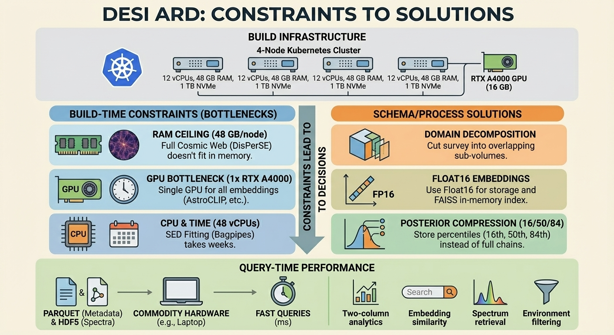
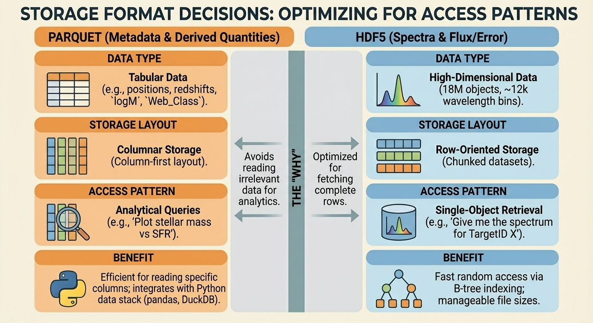

The last post talked about why Analysis Ready Datasets are important. This one is about how specific schema choices – and the hardware limits that forced them – actually work.

The DESI ARD schema looks very opinionated. Float16 precision for embeddings. Parquet for metadata and HDF5 for spectra. Percentiles instead of full MCMC chains. Domain decomposition for topology.

None of that is random. Every decision traces back to the build infrastructure: a 4-node Kubernetes cluster on 12th-gen Intel silicon with a single shared GPU.

## The Build Infrastructure

In the larger Proxmox environment, the ARD is built on a dedicated K8s cluster:

| Part    | Per Node       | Cluster Total                            |
| ------- | -------------- | ---------------------------------------- |
| vCPUs   | 12 (i9-12900H) | 48                                       |
| RAM     | 48 GB          | 192 GB                                   |
| Storage | 1 TB NVMe      | 4 TB                                     |
| GPU     | –              | 1× RTX A4000 16 GB (shared across nodes) |
| Network | 10 GbE LACP    | Not a bottleneck                         |

This isn’t modest hardware – it’s serious research infrastructure. But it’s also not an HPC center. The schema has to respect those limits, and those limits force good decisions.

The key distinction is between **build-time constraints** and **query-time requirements**.

I pay the expensive costs on this cluster so that other people can ask questions from a laptop.

---

## The RAM Ceiling: Why You Split the Domain

The 48 GB per-node RAM ceiling is the tightest constraint. It directly shapes how the topology is computed.

To use DisPerSE to extract the cosmic web, you first build a Delaunay tessellation of the tracer particles. A 3D Delaunay tessellation of N points typically yields of order ~6N tetrahedra in realistic point sets. That’s ∼100 million tetrahedra for 18 million galaxies.

Each tetrahedron needs storage for vertex indices, neighbor pointers, and filtration values. On top of that you need the density field and all the topological bookkeeping. By the time you’re done, memory use for a DESI-scale volume can easily climb into the tens to hundreds of gigabytes once you include everything, well beyond the 48 GB available on a single node.

No node in this cluster can process the full DESI volume in one pass with DisPerSE.

### The Answer: Break Up the Domain

So you cut the survey volume into overlapping cubic sub-volumes with buffer zones:

* Each sub-volume is small enough to fit in memory on a single node.
* DisPerSE runs independently on each sub-volume.
* The resulting skeletons are stitched together; the buffers handle filaments that cross sub-volume boundaries.

This makes processing slower than a hypothetical “one giant job” on a huge shared-memory box. But it turns an impossible job into a tractable one.

The topology step becomes embarrassingly parallel across sub-volumes. The stitching pass is the main serial component.

This is why the ARD philosophy treats “classify the cosmic web” as a **one-time cost**. DisPerSE at full survey scale is not something end users can rerun casually; it’s too memory-hungry outside dedicated HPC.

The ARD has to ship the web classification because most users will never be able to recompute it.

---

## The GPU Bottleneck: One A4000

The cluster has a single RTX A4000 with 16 GB of VRAM, shared across all nodes. That puts a hard ceiling on any GPU-bound workload.

### Creating Embeddings

Both the Universal Spectrum Tokenizer (Shen et al. 2025) and AstroCLIP need GPU inference. With just one A4000, embedding generation is ultimately limited by that single GPU’s throughput, no matter how many CPU nodes you have. ([arXiv][4])

A4000-class cards deliver on the order of 19 TFLOPS FP32 and ~76 TFLOPS FP16 in theory, with practical deep-learning throughput in the “hundreds of samples per second” range at reasonable batch sizes. ([Compute Prices][3])

For 18 million spectra, that translates into **tens of hours per embedding model**. Doable, but not cheap.

The schema makes this tolerable by storing embeddings as Float16:

* **Storage efficiency.**
  A 768-dimensional FP16 vector takes 1,536 bytes. For 18 million objects, that’s about 27 GB – small enough to fit the entire index in RAM on a 48 GB node.

* **Hardware alignment.**
  The A4000’s tensor cores are optimized for FP16 math. Keeping embeddings in FP16 keeps data in the same precision regime as the inference engine.

* **Enough precision.**
  For cosine-similarity search, FP16 vs FP32 is functionally the same at this scale. We’re not doing precision cosmology with these vectors; we’re asking, “Which spectra look alike?”

The result: FAISS can hold the full embedding set in memory on a single node and answer similarity queries in tens of milliseconds.

---

## The Parallel Win: Fitting SEDs

Not everything is bottlenecked.

Bayesian SED fitting with Bagpipes is embarrassingly parallel: each galaxy’s fit is independent.

The cluster has four i9-12900H CPUs, 48 vCPUs total. They’re mobile-class chips, but they’re fast: P-cores boost around 5 GHz, support AVX2, and have decent cache hierarchies. Thermal behavior under 24/7 load will depend on how good your node cooling is; in my case, external high-throughput fans keep throttling under control.

The nautilus sampler’s published benchmarks show it needs orders of magnitude fewer likelihood evaluations than older nested samplers like MultiNest for comparable posteriors – roughly O(10⁵) evaluations instead of 10⁶–10⁷, depending on the problem. ([OUP Academic][6])

Per-galaxy runtimes still span “a few minutes” to “tens of minutes” depending on model complexity. That’s where the 48 vCPUs matter.

### Honest Projection

Right now there isn’t a lot of *production* SED fitting on this cluster. The void materialization campaign will give real benchmarks.

Based on nautilus results in the literature and these hardware specs, the BGS sample (a few million bright galaxies) **should** be a campaign measured in weeks, not months.

That’s the point: a single node couldn’t do this in a reasonable timeframe. Forty-eight vCPUs running 24/7 can.

---

## Posterior Compression: Why Percentiles Win

Bayesian SED fitting returns full posterior distributions. That’s conceptually beautiful and operationally terrible at DESI scale.

If you keep 10,000 samples for a 10-parameter model, that’s 100,000 doubles per galaxy:

* 100,000 × 8 bytes = 800 KB per galaxy
* 800 KB × 18M galaxies ≈ 14 TB

You’re not shipping 14 TB of posteriors.

### The 16/50/84 Strategy

Instead, the ARD stores three numbers per parameter:

* `logM_p16, logM_p50, logM_p84` → stellar mass and 1σ bounds
* `logSFR_p16, logSFR_p50, logSFR_p84` → star formation rate and bounds
* `dust_Av_p50` → dust attenuation (point estimate)
* `age_p50` → mass-weighted age (point estimate)

This keeps posterior asymmetry (common in SFR and dust attenuation) while reducing storage by roughly three orders of magnitude.

A user who wants “error bars” can treat it as a split-normal distribution and get a reasonable approximation.

In practice, the information loss is tiny compared to the systematic uncertainties in SED fitting: IMF choices, isochrones, dust geometry, and so on. Those dominate at the ~0.1–0.3 dex level; rounding off the posterior tails doesn’t move the needle.

### Float32 for Physical Quantities

Derived physical quantities get Float32:

* Stellar masses from 10⁸–10¹² M⊙
* SFRs from ~10⁻³–10² M⊙/yr

The important thing here is dynamic range. Float32 gives ~7 significant digits – plenty for astrophysical measurements where systematics set the floor.

---

## Storage Formats: Where Parquet and HDF5 Each Fit

The NVMe drives in this cluster can deliver ~3 GB/s sequential reads. Storage bandwidth is not the bottleneck. Layout still matters.

### Parquet for Metadata

Parquet stores galaxy metadata – positions, redshifts, derived quantities, embeddings, environment flags – in a columnar layout.

That’s what you want for analytical queries:

> “Plot stellar mass vs star formation rate for galaxies in voids.”

Parquet only touches the `logM*`, `logSFR*`, and `Web_Class` columns. A row-oriented format tends to read a lot of irrelevant columns along for the ride.

Columnar storage plays nicely with pandas, DuckDB, and the broader Python data stack.

### HDF5 for Spectra

The spectra are a different story: 18 million objects, ~12,000 wavelength bins, flux + error.

The dominant access pattern is:

> “Give me all wavelengths for this one object.”

That’s row-oriented access. Parquet’s column-first layout actively fights you here.

Zarr would be attractive for cloud, but on local filesystems it tends to generate huge numbers of small files – bad news for inode limits and metadata servers on typical HPC/storage setups. ([GitHub][7])

HDF5 gives a better compromise:

* Chunked datasets aggregated into manageable files (e.g., one per HEALPix region)
* B-tree indexing for fast random access
* Natural fit for “fetch one spectrum” workloads

---

## The Schema That Falls Out

Those hardware constraints collapse into very specific schema choices:

| Column               | Type / Shape | Reason                                      |
| -------------------- | ------------ | ------------------------------------------- |
| `TargetID`           | Int64        | Primary key, aligns with HDF5 chunking      |
| `emb_shen`           | Float16[768] | GPU-aligned embedding, full index in RAM    |
| `emb_astroclip`      | Float16[512] | Cross-modal embedding, storage-efficient    |
| `logM_p16/p50/p84`   | Float32      | Posterior summary with asymmetry            |
| `logSFR_p16/p50/p84` | Float32      | Same idea for SFR                           |
| `Dn4000`             | Float32      | Empirical index, model-independent          |
| `Web_Class`          | Int8         | 0 = Void, 1 = Sheet, 2 = Filament, 3 = Knot |
| `Dist_Filament`      | Float32      | Precomputed using domain decomposition      |
| `Sigma_5`            | Float32      | Local density (5th neighbor)                |

Every type choice is either:

* A hard hardware limit, or
* A query pattern encoded in bytes.

---

## Query-Time Performance

Once the ARD is built, it’s designed to answer questions fast on commodity hardware:

* **Two-column analytics.**
  Parquet reads two numeric columns out of tens; on a laptop with 32 GB of RAM, that’s typically sub-second for “mass vs SFR in voids”.

* **Embedding similarity search.**
  In-memory FAISS on a ~27 GB FP16 index returns nearest neighbors in well under 100 ms for typical query sizes.

* **Single spectrum retrieval.**
  HDF5 with B-tree indexes can deliver “one spectrum by TargetID” in tens of milliseconds.

* **Environment-filtered queries.**
  Predicate pushdown on `Web_Class` makes “only filaments” or “only voids” as cheap as adding a WHERE clause.

Weeks of compute on the cluster collapse into **millisecond-class queries on a 32 GB laptop**.

---

## Democratization, Revisited

This is where the schema defense and the democratization argument snap together.

I have a 7-node Proxmox cluster and a dedicated K8s build grid. Most people don’t.

The ARD schema is built so that:

* I pay for domain decomposition and topology
* I live with the single-GPU embedding bottleneck
* I absorb the SED-fitting campaign that runs for weeks

…and what comes out the other side is:

* Parquet files and HDF5 archives
* Usable from any machine that can run Python and has enough RAM to hold a slice of the data

The next Hanny van Arkel doesn’t need to know how to tune DisPerSE or how many TFLOPs an A4000 sustains on FP16 inference.

They need a dataset they can actually search.

---

## The Transferable Pattern

The numbers here are DESI-specific. The pattern isn’t.

You can apply the same methodology to any big dataset project:

1. **Map your hardware envelope.**
   Peak RAM, GPU count/VRAM, storage layout, network behavior.

2. **Separate build-time from query-time.**
   What can you precompute once? What do users actually need interactively?

3. **Let limits make decisions.**
   Don’t fight them – use them to force architectures that actually fit in memory and on disk.

4. **Be honest about projections.**
   If a claim depends on benchmarks, run them and publish the numbers.

Limits aren’t just obstacles. They’re the constraints that make a design worth defending.

[1]: https://mathoverflow.net/questions/317728/complexity-of-random-delaunay-triangulation-in-3d?utm_source=chatgpt.com "Complexity of Random Delaunay Triangulation in 3D"
[2]: https://www.giss.nasa.gov/staff/mway/cluster/sousbie2011mnras.pdf?utm_source=chatgpt.com "The persistent cosmic web and its filamentary structure"
[3]: https://computeprices.com/gpus/rtxa4000?utm_source=chatgpt.com "RTX A4000 GPU Pricing & Specs (Compare 11+ Providers)"
[4]: https://arxiv.org/html/2510.17959v1?utm_source=chatgpt.com "Universal Spectral Tokenization via Self-Supervised ..."
[5]: https://academic.oup.com/mnras/article/531/4/4990/7697182?utm_source=chatgpt.com "AstroCLIP: a cross-modal foundation model for galaxies"
[6]: https://academic.oup.com/mnras/article/525/2/3181/7243406?utm_source=chatgpt.com "nautilus: boosting Bayesian importance nested sampling with ..."
[7]: https://github.com/pangeo-data/pangeo/issues/659?utm_source=chatgpt.com "Use of Zarr on HPC file systems · Issue #659 · pangeo-data ..."
