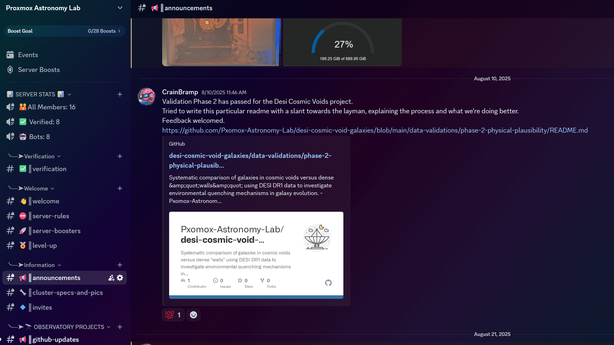

I spent $30 on Fiverr for a "Deluxe Discord Server Setup" and it was absolutely worth it.

The Proxmox Astronomy Lab wanted a collabortive community space for the RadioAstronomy.io project. Discord made sense - we're a small team, mostly async communication, and the bot ecosystem is mature. But setting up a Discord server properly takes time: channel structure, permissions, roles, integrations, bots for GitHub notifications, moderation tools, welcome flows.

I could spend 4-6 hours researching best practices, configuring plugins, and setting up integrations. Or I could pay someone who's done this a hundred times to handle the tedious parts.

## What $30 Got Me

The Fiverr seller delivered:

- Channel structure: Organized sections for server admin, projects, chat zones, with logical hierarchy
- GitHub integration: Automatic notifications for repo updates, issues, PRs
- Bot configuration: MEE6 for moderation, custom welcome messages, role assignment
- Permissions framework: Verified members, bots, admin roles properly configured
- Documentation: Channel descriptions, rules, getting started guides

Everything worked out of the box. Took them about 2 days turnaround. I spent maybe an hour reviewing the setup and tweaking a few channel names to match our terminology.

## The Cleanup

Not everything was perfect. Some of the default channel topics were generic ("share your memes here!"), the welcome message needed rewriting for our specific use case, and a few bot commands needed customization. But the infrastructure was solid - permissions were correct, integrations worked, and the organization made sense.

The alternative was me spending an evening reading Discord setup guides, another evening testing bot configurations, and probably getting the permissions wrong the first time. The $30 bought me a working baseline that I could iterate from.

## The Actual Value

This isn't about Discord being complicated - it's about recognizing where your time is best spent. I'm competent enough to configure a Discord server. I'm also competent enough to know that server setup isn't where I add unique value. My value is in the research methodology, the data processing pipelines, and the analysis frameworks.

Paying someone else to handle the commodity parts of infrastructure setup means I can focus on the non-commodity parts. This is basic economic thinking applied to personal projects.

The [Proxmox Astronomy Lab Discord](https://discord.gg/PgH7SXXn4z) is now live. We've got a small team of researchers and volunteers working on DESI analysis, and the server gives us a proper collaboration space with GitHub integration, announcements, and project-specific channels. Join if you'd like!

Sometimes "build everything yourself" is the wrong answer. Sometimes the right answer is "pay someone who's done this before and move on to the actual work."

---

*Join us at [discord.gg/PgH7SXXn4z](https://discord.gg/PgH7SXXn4z) - open invitation for anyone interested in astronomical data science, Proxmox infrastructure, or AI governance work.*
