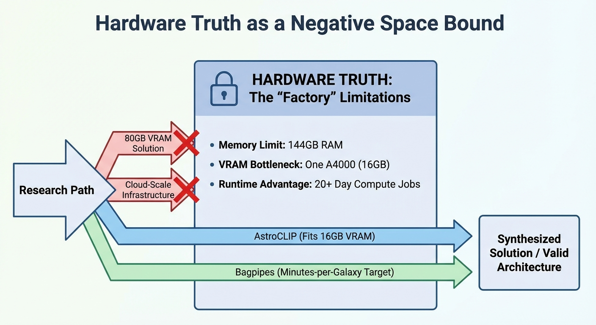
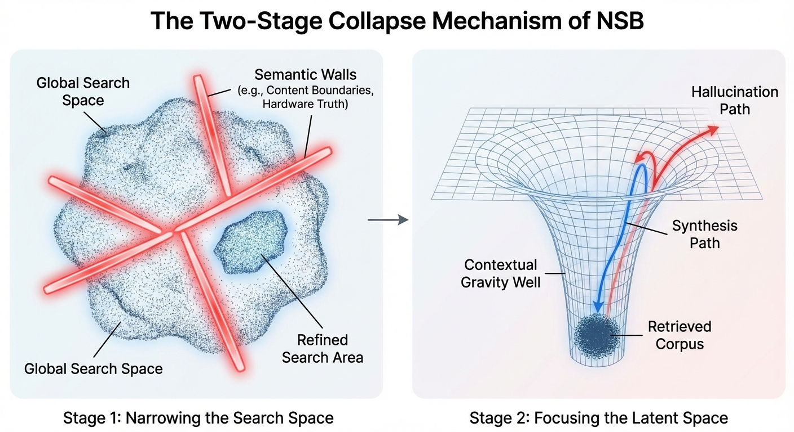

I've done more than a thousand deep research sessions with Gemini 2.5 Pro in the past 18 months.  Not just random questions, but structured research projects that cover AI policy intelligence, astronomical data architecture, compliance frameworks, and infrastructure planning.  I came up with a method called Negative Space Bounding (NSB) along the way.

 The idea is that you tell the model where to look by telling it where *not* to look. This constrains the search's latent space while still allowing the agents to explore that space. This reduces hallucinations and focuses the research to avoid extraneous material.

## The Problem with AI Research

 Traditional prompting doesn't work for research in the same ways every time. That's a problem for the scientific method.

 Prescriptive methods ("Use these sources to look for X, then Y, then Z") get in the way of the model's ability to find the best solution.  You miss connections you didn't expect.  Basically, you're using a planning engine to wrap around a search.

 When you use vague methods like "Research AI policy developments," you get exactly what you expect: general summaries, Wikipedia-level overviews, and random tangents into things that the model finds interesting but not useful.

## The Sculptor's Principle

 The idea for NSB came from a simple metaphor: to define the sculpture, take away everything that isn't the sculpture.

 I don't tell the model what to look for; instead, I set up Semantic Walls, which are barriers that block out whole areas of irrelevant information. Think of it like cauterizing whole areas of the latent space; tying off those possible paths.

 ```markdown
 CONTENT BOUNDARIES: - NO think pieces without policy substance - NO tech product news unless tied to regulatory response - NO international policy without US operational impact - NO sources prior to 2024 unless essential historical context
```

 This narrows the search area from "all AI content" to "actionable US policy changes."  The model is still completely free to move around within those limits. It can find connections that I didn't specify, but most paths don't go anywhere, which forces it to naturally converge on high-signal areas.

## Hardware Truth as a Base

 When doing research, for example, on workflows I will use in my research cluster, I base my technical research on the "Hardware Truth," which is my real world hardware contraints.  This is especially powerful because it helps to keep the model from suggesting solutions that don't fit into my infrastructure.



 ```markdown
 THE "FACTORY" LIMITATIONS:
 - Memory Limit: 144GB of system RAM.  Any analysis of a global graph must fit.
 - VRAM Bottleneck: One A4000 (16GB).  Inference must be run on this card by foundation models.
 - Advantage of runtime: it's always available.  We CAN do compute jobs that last 20 days.
```

 If an algorithm doesn't meet these requirements, throw it away.

 This makes hardware specs into a strong negative space bound.  The model can't accidentally suggest solutions that need 80GB of VRAM or cloud-scale infrastructure because those paths are blocked off at the start.

## What Real Research Looks Like

 During a DESI astronomical data architecture session, Gemini's thinking log showed this:

 > "I have finished choosing the algorithms for all three layers."  I suggest "AstroCLIP" as the main option for the vector layer because it has been tested and fits within the 16GB VRAM limit. "Universal Spectrum Tokenizer" is a good option for the future.  "Bagpipes" with the "nautilus" sampler is the confirmed choice for the scalar layer to meet the "minutes-per-galaxy" target..."

 This isn't putting things together; it's synthesis.  The model looked at a lot of different options while keeping in mind hardware limits, checked parameter counts against VRAM limits, and made architectural suggestions based on our specific infrastructure.

 The output was just as solid.  From a research session on environmental quenching in cosmic voids:

 > The quenched fraction as a function of mass, by environment WITH mass_bins AS ( SELECT env_class, WIDTH_BUCKET(LOG10(stellar_mass), 9.0, 11.5, 10) AS mass_bin, COUNT(*) AS total_gals, SUM(CASE WHEN sfr < 0.01 THEN 1 ELSE 0 END) AS quenched_gals FROM galaxies GROUP BY env_class, mass_bin ) SELECT env_class, mass_bin, (quenched_gals::DECIMAL / total_gals) AS quenched_fraction FROM mass_bins ORDER BY env_class, mass_bin;

 The model didn't make up that code snippet.  It is part of a full research framework that includes a database schema, an ETL workflow, analysis queries, Python visualization code, a project timeline, and a publication strategy. This was all made in one deep research session.  The kind of organized output that would take a graduate student weeks to put together.

## The Two-Stage Breakdown

 After hundreds of sessions, I figured out that the underlying mechanism was a two-stage collapse:



 Step 1: Making the Search Space Smaller.  Before synthesis starts, semantic walls cut down on the amount of information that can be found.  The model looks for things within certain limits, which naturally leads it to the right areas.

 Stage 2: Making the Latent Space smaller.  The retrieved corpus makes a "gravity well" in the space where the model generates things. For the model to get out of research alignment, it must 'climb out' of this 'contextual gravity well' to hallucinate. Much harder.
