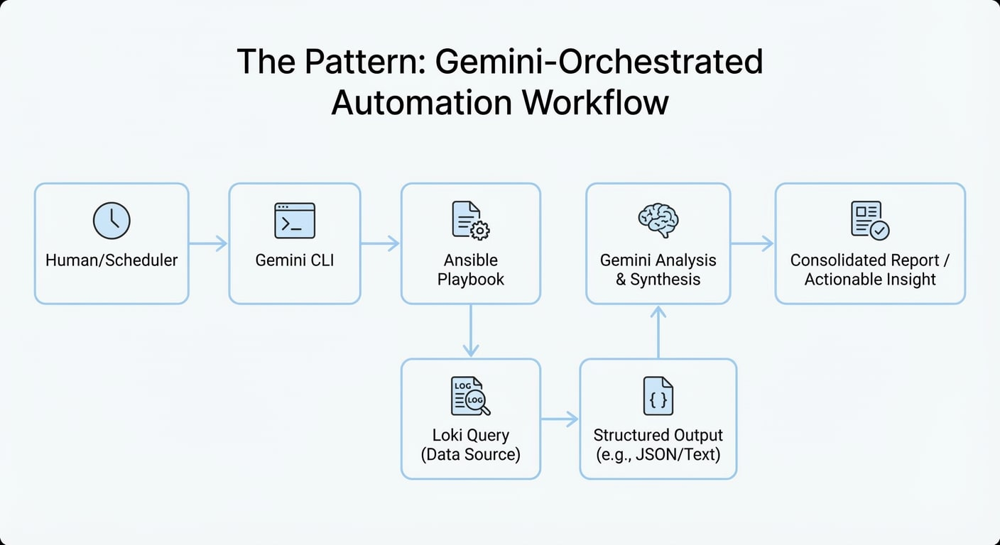
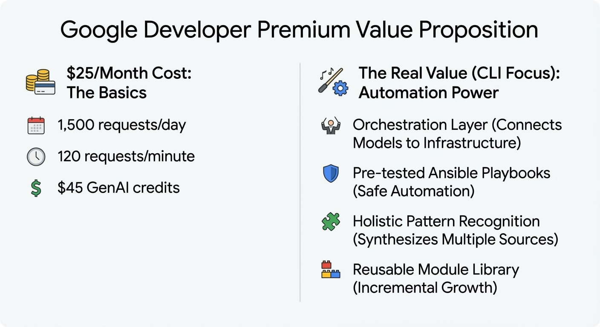

It costs $25 a month to subscribe to Google Developer Premium. Most of Google's marketing focuses on Firebase workspaces and certification vouchers, which are both cool features, but you need to look deeper to find the real value. You can also make 1,500 requests to Gemini 2.5 Pro at the command line every day.

That's not "talk in a terminal."  That orchestration layer connects a frontier model to the automation infrastructure you already have.

## What you really get for $25 a month

The tier breakdown is important:

- 120 requests per minute (the most requests that can be handled at once)
- 1,500 requests a day (shared with Code Assist Standard)
- $45 a month in GenAI credits (almost enough to pay for the subscription in API equivalents)
- $500 bonus for getting certified - Code Assist Standard in VS Code/JetBrains (more on this in a separate post)

The CLI tho, that's where the magic really happens. The command "gemini --prompt" lets you basically run a full frontier model at the command line; option `--output-format json` lets you get structured responses. MCP server integration means that the same set of tools we made for Claude Desktop or other agents will work here.

## The Pattern: Using AI to automate things safely

My Proxmox cluster has 27 virtual machines. Loki gets logs, Prometheus gets metrics, and staging directories get data about compliance. In the past, you had to write dashboards, check them by hand, and then see problems after they got worse. Or you could go through a lot of emails and alerts that don't really mean anything.

The Gemini CLI method uses AI to put together data from different places and show you what you need to know.

But I'm not asking Gemini to write queries or run commands whenever it wants. That's asking for problems and hallucinations, maybe real damage. Instead, Gemini calls pre-tested Ansible playbooks that return structured data.



This LogQL query runs against Loki in the Ansible playbook:

```logql
{job="systemd-journal"} 
  |= "" 
  | json 
  | line_format "{{.hostname}} {{._PRIORITY}} {{.MESSAGE}}"
  | __error__=""
[24h]
```

That returns the last 24 hours of syslog across all VMs. Some cherry-picked sample output:

```markdown
radio-pgsql01 6 PostgreSQL checkpoint complete: wrote 1247 buffers (7.6%)
radio-k8s01 4 kubelet: node radio-k8s01 memory pressure threshold exceeded
radio-agents01 6 ansible-runner: playbook cluster-health completed rc=0
radio-docker02 5 containerd: container "grafana" OOMKilled, restarting
radio-mon01 6 prometheus: TSDB compaction completed in 4.2s
radio-gpu01 6 ollama: model llama3.2 loaded, VRAM usage 14.2GB/16GB
```

Six lines. But look what's actually there:

- Memory pressure on k8s01 (investigate before it cascades)
- OOMKilled container on docker02 (Grafana needs resource limits adjusted)
- GPU near capacity on gpu01 (14.2/16GB VRAM—fine for now, but no headroom)
- Healthy checkpoints from PostgreSQL and Prometheus (no action needed)

The playbook saves this to `/opt/aiagents/working/cluster-logs-24h.txt`. Then a second Gemini CLI call:

```bash
gemini --prompt "Analyze the cluster logs at /opt/aiagents/working/cluster-logs-24h.txt and output as structured markdown following the template at /opt/aiagents/templates/daily-report.md" \
--output-format text > /opt/aiagents/staging/logs-summary-$(date +%Y%m%d).md
```

Files in the staging directory gets picked up by downstream automation. The log summary joins the security report, drift detection results, and astronomy workload status in a consolidated "State of the Cluster" daily digest that I get in my inbox daily.

## The Insight: Holistic Pattern Recognition

What makes this valuable isn't any single query—it's synthesis across sources. When Gemini sees:

- k8s01 memory pressure in logs
- k8s01 pod count running high at 47
- k8s01 running astronomy ETL job from scheduler status w/a detailed description of that job

It connects dots I might miss checking each system individually. "Memory pressure correlates with DESI ingestion job; consider <insert suggested actions>"

That's not replacing human judgment. It's augmenting it by surfacing patterns across 27 VMs, 6 data sources, and whatever context the model can synthesize.

## Building the Library

The initial setup isn't trivial—you're building playbooks, testing queries, validating outputs. But each workflow becomes a reusable module:

- `cluster-logs-24h.yml` - Daily log synthesis
- `security-summary.yml` - Wazuh alerts and compliance status  
- `drift-report.yml` - CMDB delta since last snapshot
- `workload-status.yml` - K8s astronomy jobs, GPU utilization

Once built, they're safe to run anytime, by any process, including AI. The library grows incrementally. And at 1,500 requests/day, you have headroom to experiment.



---

*Google Developer Premium is $24.99/month or $299/year. The [Gemini CLI documentation](https://cloud.google.com/gemini/docs/codeassist/gemini-cli) covers installation and MCP configuration. Code Assist Standard—also included—deserves its own post.*
