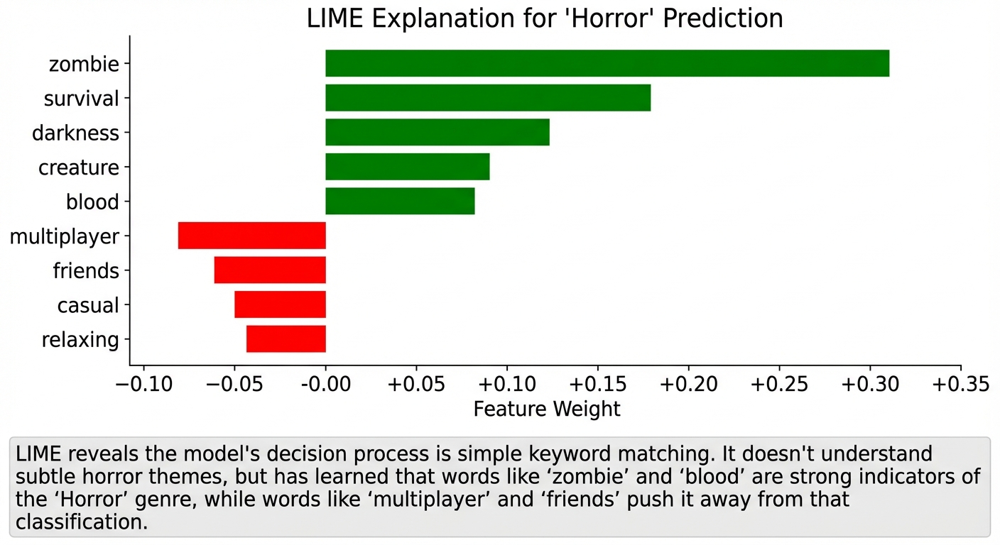

LIME (Local Interpretable Model-agnostic Explanations) helps understand what a text classifier is actually learning. For my Steam Dataset 2025, I had a ton of game text data and this was a perfect playground to do some Explainable AI in.

Spoiler: it learned to look for the word "zombie."

## The Setup

The [Steam Dataset 2025](https://github.com/vintagedon/steam-dataset-2025) includes game descriptions and genre tags for 260,000+ titles. I trained a logistic regression classifier on TF-IDF vectors to predict whether a game is tagged "Horror" based on its store description.

## Without Explainability

Standard workflow - vectorize text, train classifier, check accuracy:

```python
from sklearn.feature_extraction.text import TfidfVectorizer
from sklearn.linear_model import LogisticRegression
from sklearn.metrics import accuracy_score

# Convert game descriptions to TF-IDF vectors
# TF-IDF weights words by importance: common words get low scores,
# distinctive words get high scores
vectorizer = TfidfVectorizer(max_features=5000, stop_words='english')
X_train_vec = vectorizer.fit_transform(X_train)
X_test_vec = vectorizer.transform(X_test)

# Train logistic regression classifier
# Simple, fast, works well for text classification baselines
model = LogisticRegression(max_iter=1000)
model.fit(X_train_vec, y_train)

# Check accuracy on held-out test set
y_pred = model.predict(X_test_vec)
accuracy = accuracy_score(y_test, y_pred)
print(f"Accuracy: {accuracy:.2%}")  # 87%

# Model works, but what's it actually learning?
# Is it understanding horror themes, or just pattern matching?
```

87% accuracy sounds good. But text classifiers are notorious for learning shortcuts - dataset artifacts, obvious keywords, spurious correlations. Without looking inside, I don't know if the model learned "horror" or learned "contains the word zombie."

## With LIME

LIME (Local Interpretable Model-agnostic Explanations) explains individual predictions by perturbing the input and seeing what changes the output. For text, it removes words and measures the effect on prediction confidence.



```python
from lime.lime_text import LimeTextExplainer

# Create explainer for binary classification
# class_names helps LIME label the output classes in visualizations
explainer = LimeTextExplainer(class_names=['Not Horror', 'Horror'])

# Pick a game the model classified as Horror with high confidence
# We want to understand WHY this specific prediction was made
test_game = X_test.iloc[42]  # Some zombie survival game
print(f"Description: {test_game[:200]}...")

# Generate explanation by perturbing the text
# LIME removes words, re-predicts, and measures which removals
# change the prediction most - those words are most important
# num_features=10 shows top 10 most influential words
explanation = explainer.explain_instance(
    test_game,
    lambda x: model.predict_proba(vectorizer.transform(x)),
    num_features=10
)

# Show which words pushed toward/away from "Horror" classification
# Green = supports Horror prediction, Red = supports Not Horror
explanation.show_in_notebook()

# Or get the raw feature weights for programmatic analysis
# Positive weight = pushes toward Horror, negative = away from Horror
print(explanation.as_list())
# [('zombie', 0.31), ('survival', 0.18), ('darkness', 0.12), 
#  ('multiplayer', -0.08), ('friends', -0.06), ...]
```

## What I Learned

LIME revealed the model's decision process is embarrassingly simple:

Top Horror indicators:

- "zombie" (+0.31)
- "survival" (+0.18)
- "darkness" (+0.12)
- "creature" (+0.09)
- "blood" (+0.08)

Top Not-Horror indicators:

- "multiplayer" (-0.08)
- "friends" (-0.06)
- "casual" (-0.05)
- "relaxing" (-0.04)

The model didn't learn subtle horror themes like dread, isolation, or psychological tension. It learned keyword matching. Games with "zombie" in the description get classified as Horror. Games with "friends" get classified as Not Horror.

This explains the 87% accuracy - most horror games do mention zombies, blood, or darkness. But it also explains the 13% errors. Psychological horror games without obvious keywords get misclassified. Action games with zombie modes get incorrectly flagged as Horror.

## Why This Matters

For the Steam Dataset ARD, this changes the approach:

Embedding-based classification is better. The vector embeddings capture semantic meaning, not just keyword presence. A game described as "atmospheric tension" and "creeping dread" will cluster with horror games in embedding space even without explicit horror keywords.

Keyword classifiers have their place. For quick filtering or baseline models, they work. But they're not learning genre - they're learning vocabulary correlation.

LIME catches shortcuts. Without explainability, I would have deployed an 87% accurate model that's actually just a keyword detector. LIME exposed the shortcut in five lines of code.

## LIME vs SHAP

Both tools explain model predictions, but they work differently:

| Aspect | SHAP | LIME |
|--------|------|------|
| Approach | Game-theoretic feature attribution | Local linear approximation |
| Scope | Global and local explanations | Local explanations only |
| Speed | Fast for tree models (TreeExplainer) | Slower (requires many model calls) |
| Text support | Requires custom setup | Native text explainer |
| Best for | Tabular data, tree ensembles | Text, images, any model |

For the galaxy classification in [the SHAP post](/p/shap-galaxy-classification/), SHAP was the right choice - tabular data with a random forest. For text classification here, LIME's native text support makes it easier to work with.

Use the tool that fits the data type and model architecture.

## Bottom Line

LIME takes a black-box text classifier and shows you exactly which words drive each prediction. Sometimes that reveals sophisticated pattern learning. Sometimes it reveals your model is just grepping for "zombie."

Either way, you should know before deploying.

---

*LIME works with any classifier that outputs probabilities. Install with `pip install lime`. Documentation at [github.com/marcotcr/lime](https://github.com/marcotcr/lime).*
