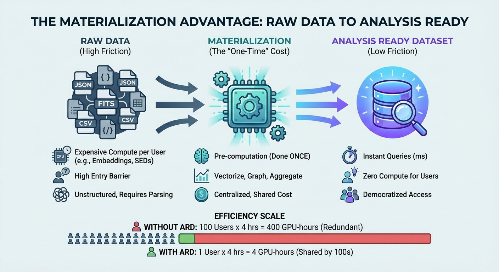

The [Steam Dataset 2025](https://github.com/vintagedon/steam-dataset-2025) has been live for about two months. The numbers are in: 9,826 views, 1,565 downloads on Kaggle, another 71 downloads on Zenodo. A 16% conversion rate from viewing to actually pulling the data.

Those numbers validated something I'd been thinking about for a while: materialization matters.

## The Hypothesis

Most datasets are raw. They give you the ingredients but expect you to do all the cooking. Want to do similarity search across 260,000 video games? Generate your own embeddings. Want to analyze publisher relationships? Build your own graph. Want semantic search? Set up your own vector database.

The friction isn't in accessing the data. It's in making the data *useful*.

The Steam Dataset took a different approach. Instead of publishing raw API responses, I front-loaded the computational work:

- BGE-M3 embeddings (1024-dimensional vectors) pre-computed for every game description
- Graph relationships materialized between publishers, developers, and genres
- Materialized views for common analytical queries
- Multi-modal database architecture combining relational, document, and vector storage

The hypothesis: if you remove the friction between "I have data" and "I can answer questions," people will actually use it.

1,500 downloads in two months suggests the hypothesis holds.

## What Materialization Actually Means

Materialization is a database concept that most people encounter as "materialized views" - pre-computed query results stored as tables. But the principle extends beyond SQL.

Any time you take an expensive operation and store the result instead of recomputing it on demand, you're materializing. The tradeoff is storage space versus compute time. For large datasets with common access patterns, that tradeoff is almost always worth it.

For the Steam Dataset, materialization meant:

**Vector Embeddings**: Running BGE-M3 inference on 260,000 game descriptions takes hours on a GPU. But once those embeddings exist as columns, similarity search is milliseconds. The cost is paid once, during data preparation. Every subsequent user benefits.

**Graph Relationships**: Extracting publisher-developer-genre relationships from raw JSON requires parsing, deduplication, and normalization. Materializing those relationships into a graph structure means users can traverse connections without understanding the source data model.

**Analytical Aggregations**: Common questions like "What's the average price by genre?" or "How many games does each publisher have?" become instant lookups instead of full table scans.

The pattern: identify what users will need to compute, compute it once, store the results.

## The Economics of Pre-Computation

Here's the math that makes materialization compelling:

**Without materialization**: Every user who wants embeddings runs inference. If 100 users each spend 4 GPU-hours generating embeddings, that's 400 GPU-hours of redundant work.

**With materialization**: I spend 4 GPU-hours once. 1,500 users download the result. Total compute: 4 hours instead of 6,000 hours.

The efficiency gain scales with users. The more people who need the same derived data, the more valuable it is to compute it centrally.

This is why cloud data warehouses charge for query compute but give storage almost free. Storage is cheap. Redundant computation is expensive.

## Validating the Approach

The download numbers are one signal. But the more interesting validation is *who* downloads and *what they do with it*.

Looking at Kaggle engagement:

- Data scientists exploring multi-modal database patterns
- ML engineers testing recommendation system architectures  
- Researchers studying gaming industry dynamics
- Students learning vector search implementations

These aren't people who couldn't generate their own embeddings. They're people who want to skip the infrastructure work and get to the interesting questions faster.

That's the value proposition of materialization: it lets domain experts stay in their domain instead of becoming infrastructure engineers.

## The Next Dataset: DESI Astronomical Spectroscopy

The Steam Dataset was a proof of concept. The real target is astronomical data.

[DESI Data Release 1](https://data.desi.lbl.gov/doc/releases/dr1/) contains 6.4 million galaxy spectra. The raw data is publicly available. But like the Steam catalog before I processed it, the raw data isn't analysis-ready.

To answer basic research questions - "How does star formation vary with cosmic environment?" - a researcher currently needs to:

1. Download and parse thousands of FITS files
2. Run Bayesian SED fitting to derive stellar masses and star formation rates (hours per galaxy)
3. Calculate spectral indices like Dn4000 and HδA
4. Cross-match with void catalogs to determine cosmic web environment
5. Compute local density metrics

That's months of pipeline development before asking the first scientific question.

The Analysis Ready Dataset approach: materialize all of it.

- **AI Layer**: Pre-computed embeddings from spectral foundation models (Universal Spectrum Tokenizer, AstroCLIP)
- **Physics Layer**: Bayesian-derived stellar masses, SFRs, ages, with posterior percentiles
- **Topology Layer**: Cosmic web classification (void/filament/cluster), distance to nearest filament, local density

Same philosophy as Steam: identify what researchers need to compute, compute it once, make the results queryable.

## Why This Matters for Democratization

The real goal isn't efficiency - it's access.

A graduate student at a well-funded university can probably wrangle the compute resources to process DESI data. A brilliant undergrad in Lagos, a curious data scientist in rural Ohio, a retired physicist who wants to explore? They're locked out by infrastructure requirements, not by ability.

Materialized datasets change who can participate. When the expensive computation is already done, the barrier to entry drops from "access to GPU cluster" to "can write SQL" or "can use pandas."

The Steam Dataset downloads came from everywhere - not just institutions with compute infrastructure. That's the democratization thesis in action.

## The Pattern Generalizes

Steam and DESI are different domains. Video games and galaxy spectra have nothing in common except the data engineering pattern:

1. Raw data exists but isn't analysis-ready
2. Common derived quantities require expensive computation
3. Many users need the same derived quantities
4. Centralizing that computation creates value

Any domain where this pattern holds is a candidate for the ARD approach. Medical imaging, legal document analysis, climate modeling, genomics - anywhere raw data requires substantial processing before it becomes useful.

Materialization matters because it converts "data available" into "questions answerable."

## What's Next

The Steam Dataset proved the concept. The DESI ARD is the serious application.

Over the next few posts, I'll detail the specific architecture: why the schema looks the way it does, how hardware constraints shaped design decisions, and what research becomes possible when friction drops from months to seconds.

The 1,500 downloads gave me confidence the approach works. Now it's time to apply it where it matters.

---

*Steam Dataset 2025 available on [GitHub](https://github.com/vintagedon/steam-dataset-2025), [Kaggle](https://www.kaggle.com/datasets/crainbramp/steam-dataset-2025-multi-modal-gaming-analytics), and [Zenodo](https://doi.org/10.5281/zenodo.17286923). DESI ARD architecture documentation in progress at [RadioAstronomy.io](https://radioastronomy.io).*
