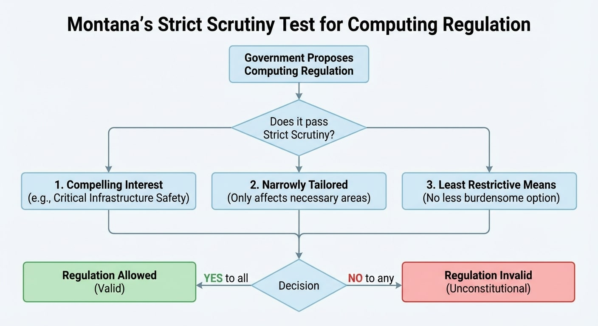
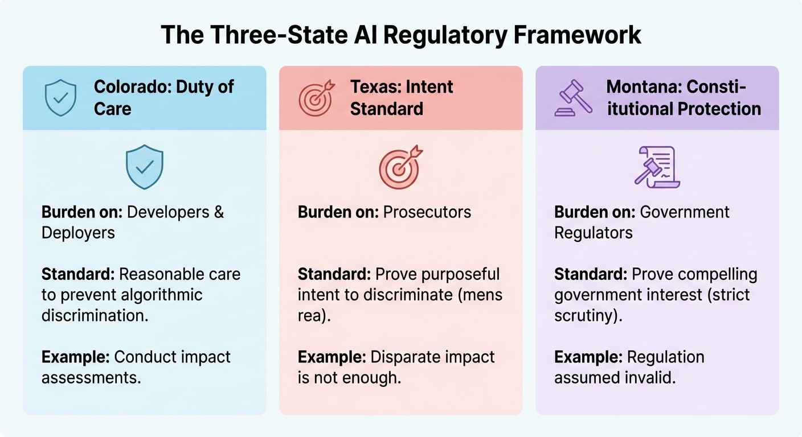

We've been talking about AI Policy in the US, let's continue that discussion with Montana.

Colorado asks AI builders, "Did you do everything you could to keep people safe?"
Texas asks prosecutors, "Can you show that they meant to hurt?"
Montana asks the government, "Do you have a good reason to limit access to computers at all?"

Three states, three very different answers to the question of who is responsible and for what.

On April 17, 2025, Governor Greg Gianforte signed the [Montana Right to Compute Act](https://leg.mt.gov/bills/2025/billpdf/SB0212.pdf). Montana isn't regulating AI like Colorado and Texas are. It is protecting access to computers from regulation by applying existing constitutional rights to the digital world.

## The Extension of the Constitution

Montana's approach is based on two parts of the Montana Constitution: Article II, Section 3, which says that people have the right to own property, and Article II, Section 7, which says that people have the right to free speech. The legislature's message is clear: these existing protections "embody the notion of a fundamental right to own and make use of technological tools, including computational resources."

This is not establishing a new right. It says that current constitutional protections already cover hardware, software, algorithms, and data processing tools. The legislature is telling Montana courts how to understand protections that have been in place since the Montana Constitution was written in 1972.

Any government limit on computing power must now pass strict scrutiny: it must be "demonstrably necessary and narrowly tailored to fulfill a compelling government interest."  The same constitutional test is used for limits on speech, religion, and racial classifications. In American constitutional law, it's the highest bar.

## What Strict Scrutiny Really Means

The government has to prove its case when it is under strict scrutiny. The presumption changes from "regulation is valid unless you prove otherwise" to "regulation is invalid unless the government proves necessity."  Adam Thierer of the R Street Institute said in [Pluribus News](https://pluribusnews.com/news-and-events/right-to-compute-bills-push-back-on-ai-regulation), "A right to compute essentially reverses the burden of proof on digital innovators. … They are innocent until proven guilty.".

When courts use strict scrutiny, they want the government to show three things: a compelling interest (not just a legitimate or important one), narrow tailoring (the restriction only affects what's necessary), and least restrictive means (there's no other option that is less burdensome). Most laws that are put under strict scrutiny don't pass. Legal experts often say that it is "strict in theory, fatal in fact."

Montana's law says that a compelling interest is making sure that AI systems for critical infrastructure have risk management policies, stopping behavior that tricks or defrauds the public, keeping minors safe from harmful synthetic content like deepfakes, and stopping problems caused by physical datacenter infrastructure. These safe harbors recognize the government's real interests while also making it clear where the lines are.

## The Sleeper Provision

Montana didn't give up all control. Section 4 says that any critical infrastructure facility run by an AI system must "develop a risk management policy" that takes into account advice from the NIST AI Risk Management Framework, ISO/IEC 42001, or another well-known framework. This requirement is met by following federal rules.

Both states use NIST AI RMF as a standard for their affirmative defense structure, which is similar to Colorado's. But the way they frame it is very different. "You must take reasonable care," says Colorado, "and following NIST helps prove you did."  Montana says, "The government can't stop you, but you have to follow recognized frameworks for critical infrastructure."

Same end point for important systems. A completely different trip.

## The Three-State Burden Framework

The new AI regulatory landscape now has three different models:

**Colorado (Duty of Care)**: Developers and deployers must show that they took reasonable steps to stop algorithmic discrimination. The responsibility lies with those who create and use AI systems. Proactive duties like impact assessments, risk management policies, and consumer notifications are written down and shown.

**Texas (Intent Standard)**: Prosecutors must show that developers or deployers purposefully built systems for illegal purposes. "Disparate impact alone is not enough to prove that someone meant to discriminate."  The state has to prove mens rea, which is a traditional criminal law standard that is used to regulate AI.

**Montana (Constitutional Protection)**: The government must show a strong reason to limit access to computers at all. It is the job of regulators, not developers, to do this. Innovation is assumed to be legitimate; restrictions must be justified by the highest constitutional standard.

These are not just different rules for compliance. They are based on very different ideas about AI, innovation, and what the government should do.

## What This Means for People Who Work in the Field

The laws in Montana for using AI systems are very different from those in Colorado or Texas. You're not figuring out how to follow the rules or write down your intentions. Instead, you're working in a place where the government has clearly protected your right to compute.

That protection isn't perfect. Critical infrastructure systems still need to follow NIST guidelines for managing risk. Fraud, deepfakes aimed at kids, and problems in data centers can still be regulated. Montana has put down what the Frontier Institute calls "a flag in the ground" for computational freedom, but only in those specific areas.

The real question for operators in more than one state is: can you make a compliance program that meets Colorado's duty of care, shows intent for Texas, and is based on Montana's constitutional protection?  Most likely yes—good governance practices work well in other places. But the mental model changes from one jurisdiction to another. In Colorado, you're showing that you tried. In Texas, you're showing that you didn't mean to hurt anyone. In Montana, the government mostly leaves you alone unless it can prove otherwise.

## The Movement Spreads

Montana is not alone. New Hampshire introduced [CACR 6](https://www.gencourt.state.nh.us/bill_status/billinfo.aspx?id=339), a proposed constitutional amendment that would protect the right to compute directly in the state constitution, which is more than what Montana's law does. Idaho passed a law that was similar. The "right to compute" movement, led by advocacy groups and backed by free-market think tanks, sees access to computers as a basic freedom in the digital age, along with speech and property.

The success of this model depends on how well the experiment in Montana goes. Does constitutional protection bring in new tech investments and ideas?  Is the critical infrastructure carve-out enough to keep people safe?  Do courts take a narrow or broad view of "compelling interest"?

We're watching a live test of how rules should work. Colorado checks to see if the duty of care stops algorithmic harm. Texas tests whether standards of intent strike a balance between accountability and innovation. Montana is testing whether treating computation as a constitutional right encourages innovation while still keeping important protections in place.

The answers won't be based on theory.

---

## Further Reading

- [Montana SB 212 Full Text](https://leg.mt.gov/bills/2025/billpdf/SB0212.pdf) - The complete Right to Compute Act
- [Strict Scrutiny (Cornell LII)](https://www.law.cornell.edu/wex/strict_scrutiny) - Legal definition and requirements
- [Frontier Institute Model Legislation](https://frontierinstitute.org/model-legislation-the-right-to-compute-act/) - Policy framework behind the bill
- [Center for Data Innovation Analysis](https://datainnovation.org/2025/09/how-some-states-are-resisting-unnecessary-ai-regulations/) - Comparison with New Hampshire and Idaho approaches
- [Future of Privacy Forum: State of State AI 2025](https://fpf.org/blog/the-state-of-state-ai-legislative-approaches-to-ai-in-2025/) - Comprehensive state legislation overview