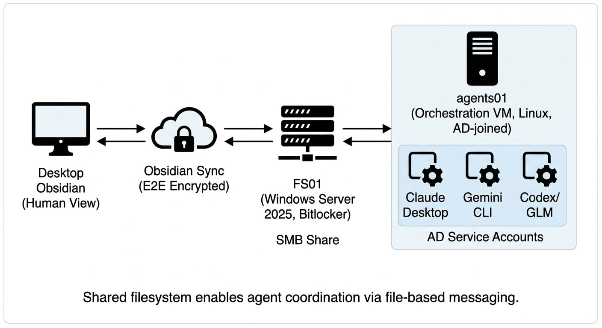
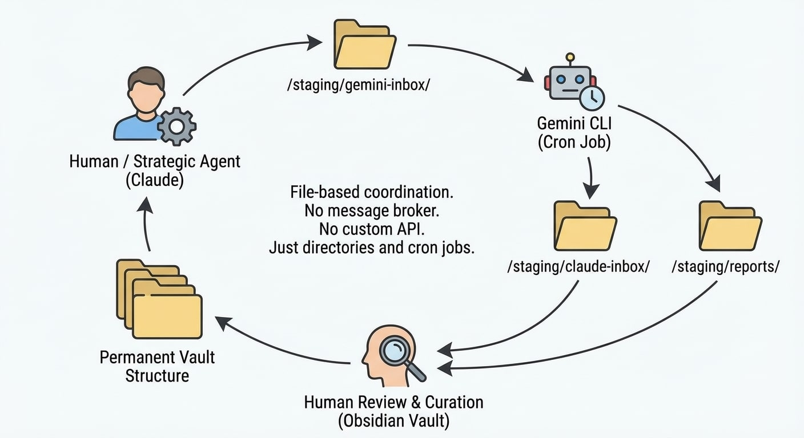

Lately, I have been thinking about automation and multi-agent orchestration. All of my normal workflows are AI native, and Claude Max is my daily driver, specifically for it's MCP and tool usage and I wanted a way to move beyond the chat interface. I have deeper plans, but here's what's actually running operationally on my cluster: an Obsidian vault, an SMB share, and Active Directory accounts.

That's the whole coordination layer. It's in alpha. It has warts, but it works.

## The Components

Obsidian Sync ($8/month) provides E2E encrypted, *versioned* synchronization between endpoints. It also handles multiple agents writing to the vault simultaneously.

One vault lives on my desktop and Obsidian is my 'window' into the 'system'. It will even update a file live in my view when saved on agents01, for example. This then syncs to mobile, and to FS01 (a Windows Server 2025 file server with Bitlocker encryption at rest). Finally, an SMB share mounts that to agents01 (my orchestration VM).

All servers—including the Linux boxes—are AD-joined. Each agent (Claude, Gemini CLI, Codex, GLM) operates under its own AD service account with appropriate permissions.

That's the infrastructure. Obsidian Sync solves the hard distributed systems problem. SMB and AD are enterprise standards that security teams already understand.

## The Communication Substrate

The real power isn't in any single component—it's in what they enable together: a shared filesystem where AI agents can read and write with near-instant synchronization and proper access control.



Every agent with vault access can:

- Read the current state of projects, documentation, and context
- Write outputs to designated directories
- See what other agents have produced

The coordination pattern is file-based messaging. The same approach that's run batch processing since the 1970s, except now the processors are frontier AI models.

## The Staging Directory Pattern

Here's how agents actually communicate:

```markdown
/staging/
├── gemini-inbox/      # Tasks for Gemini CLI to process
├── claude-inbox/      # Items awaiting my review
├── <agent>-inbox/     # any other coding bot or agentic process
├── reports/           # Generated reports from any agent
└── work-in-progress/  # Active processing area
```

So, I write a task file to `/staging/gemini-inbox/`. Gemini CLI runs on a 5-minute cron, scrapes the directory, processes whatever it finds. Results land in `/staging/claude-inbox/` or `/staging/reports/`.

I process my inbox, curate valuable content into the permanent vault structure, respond if needed. The cycle continues.



No message broker. No custom API. No coordination service. Just directories, files, and cron jobs watching them.

## What's Working Now

This is alpha-stage infrastructure. But the core loop is tested and functioning:

- Claude Desktop (me, via Claude Max, Opus 4.5) handles strategic orchestration—vault maintenance, reviewing agent outputs, generating playbooks, architectural decisions
- Gemini CLI handles operational bulk work—compliance analysis, log processing, report generation, scheduled automations
- OpenAI Codex Max CLI handles coding and other related work
- Claude Code handles coding and other related work
- Kilo Code CLI w/GLM4.6 via Z.ai coding bot plans handles coding and other related work
- Continue.dev, Cline, RooCode ... you get the idea, but anything swaps in at this layer
- Human (you) maintains approval authority—all infrastructure changes flow through Gitea PRs with explicit sign-off

The division of labor follows economics: Claude tokens are expensive, so I focus on high-value reasoning. Gemini CLI has 1,500 requests/day included with Google Developer Premium, so it handles volume work while all models do coding work inside VSCode according to their strengths.

## The Three-Pane Model

### Human Control Plane (VS Code + Kilo Code)

Your workstation runs VS Code with direct access to cluster services—PostgreSQL, MongoDB, Redis via extensions. Kilo Code provides model orchestration across providers. This is where decisions happen, PRs get approved, and strategic direction is set.

### Strategic Orchestration (Claude Desktop)

All agents can access tools via MetaMCP aggregator on agents01, which provides uniform tool access—database queries, Grafana metrics, filesystem operations, Hugging Face search, BASH operations, and much more. My role is vault curation, compliance review, playbook generation, and coordinating the work other agents produce.

### Operational Execution (Gemini CLI + Cron)

Scheduled jobs handle the bulk work that doesn't need human attention or expensive reasoning. Log analysis, compliance scans, report generation, news monitoring. Outputs land in staging directories for review.

The Obsidian vault is the coordination surface connecting all three.

## Compliance Already Built In

The security properties fall out naturally from the component choices:

- Encryption in transit: Obsidian Sync is E2E encrypted
- Encryption at rest: FS01 runs Bitlocker
- Access control: AD service accounts with RBAC
- Audit trail: Git plugin tracks all vault changes
- Change approval: Infrastructure changes require Gitea PR approval

SMB shares, AD permissions, and Bitlocker are nothing new. There's no novel security model to evaluate—just standard enterprise patterns applied to AI agent coordination.

## A Note on Obsidian Sync

Yes, it's another service. Another attack surface. You could absolutely build this with Syncthing or a custom rsync solution and keep everything on-premises.

But for $8/month, Obsidian Sync meets my compliance requirements and provides a stable foundation for testing whether this coordination pattern works at all. It sits within my risk appetite for prototype infrastructure.

If this scales to production workloads, I'll revisit that decision. For now, I'm validating the pattern before over-engineering the plumbing.

## What Comes Next

Once the communication substrate is stable and the basic agent loop is reliable, then it's time to get fancy:

- Knowledge graphs in Neo4j for relationship tracking
- Vector embeddings in pgvector for semantic search across agent outputs
- More sophisticated task routing based on content type

But that's another article. Right now, the foundation is files in directories with cron jobs and AD permissions. It's boring infrastructure that happens to enable AI agents to coordinate work.

Sometimes boring is exactly what you need.

---

*This architecture runs on a 27-VM Proxmox cluster. agents01 handles orchestration services, FS01 provides the sync endpoint, and the Obsidian vault ties everything together. The staging directory pattern is deliberately simple—prove the concept works before adding complexity.*
