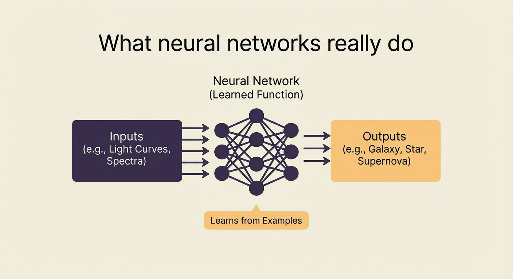
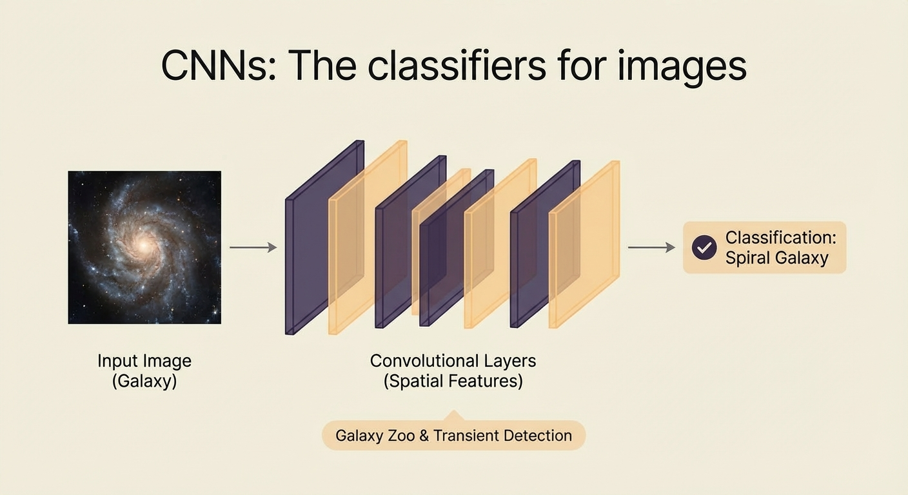
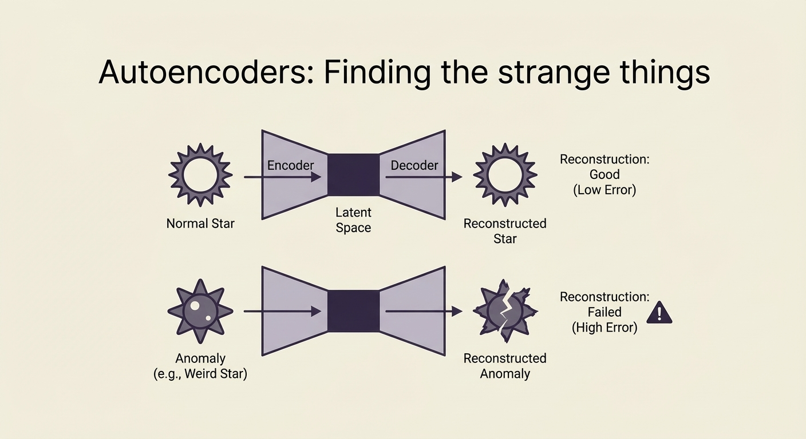

When the Vera C. Rubin Observatory in Chile is fully up and running, it will collect about 20 terabytes of data every night. Every night for ten years, twenty terabytes.

No one is looking at those pictures. The scale makes it impossible to do it. Neural networks are the ones doing the looking, sorting galaxies, finding transients, flagging strange things, and matching objects across catalogs. Neural networks are the tools of the trade in modern astronomy, which is now a field of data engineering.

As I work on processing DESI survey data through RadioAstronomy.io, I've been thinking about this a lot. The methods aren't new. They're the same neural network architectures you'd find in any ML book, but instead of cat pictures, they're pointed at stars.

## What neural networks really do

At its core, a neural network is a way to guess what a function will do. You give it inputs, and it gives you outputs. The cool thing is that it learns how they are related from examples instead of from rules.

This is important for astronomy because it's really hard to write down the rules for "is this a galaxy or a star?" or "is this light curve showing a supernova?"  There are edge cases all over the place. But if you give a neural network a few hundred thousand labeled examples, it will make its own internal model of what matters.

## CNNs: The classifiers for images

Convolutional neural networks are very good at finding patterns in pictures. A great example of galaxy morphology classification is figuring out if a galaxy is spiral, elliptical, or irregular. The network learns to tell them apart by their spatial features.

The Galaxy Zoo project is well-known for getting these classifications from volunteers. Now, CNNs can do the same job on a larger scale, using those examples that people have labeled. The people showed the machines what to look for.

The same goes for transient detection. There is a difference between the picture from last night and the one from tonight. Is it interesting?  A hit by a cosmic ray?  A rock from space?  A supernova?  CNNs learn how to tell the difference between the signal and the noise.

## Autoencoders: Finding the strange things

This is where discovery starts to get interesting. A machine learning model called an autoencoder learns how to compress and reconstruct data. It gets really good at putting normal stars back together if you train it on them. But if you show it something that doesn't fit the pattern, like a star, the reconstruction doesn't work at all.

That mistake in the reconstruction is a sign that this one is different. Detecting anomalies without having to know what they look like ahead of time. You're really asking, "What doesn't fit the normal model?"

This is very important for a field where the most interesting science often comes from the unexpected.

## The infrastructure that no one talks about

What stands out to me about all of this is how much hidden infrastructure is needed for it to work. Rubin works with Kubernetes. There are data pipelines, systems for versioning models, and inference servers that process images almost in real time. The telescope is the cool part, but the systems engineering is what actually makes science happen.

This is one of the reasons I began writing about systems engineering in astronomy. The methods aren't just for astronomy; they're the same MLOps patterns that any big tech company would use. But the application domain makes them real in a way that "we optimized ad click prediction" never quite does.

Every night, twenty terabytes. Neural networks going over everything.

That's how astronomy works today. The telescope still points at the sky, but the real work is done in the pipeline.

---

*This is part of an occasional series on systems engineering in astronomy. I run RadioAstronomy.io, where I'm processing DESI survey data and learning a lot about what it takes to do science at scale.*
