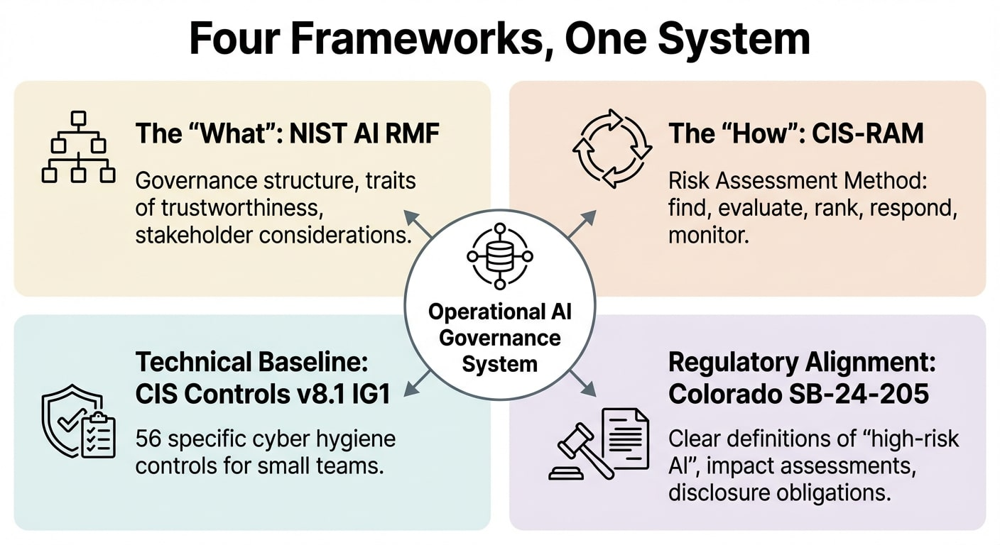
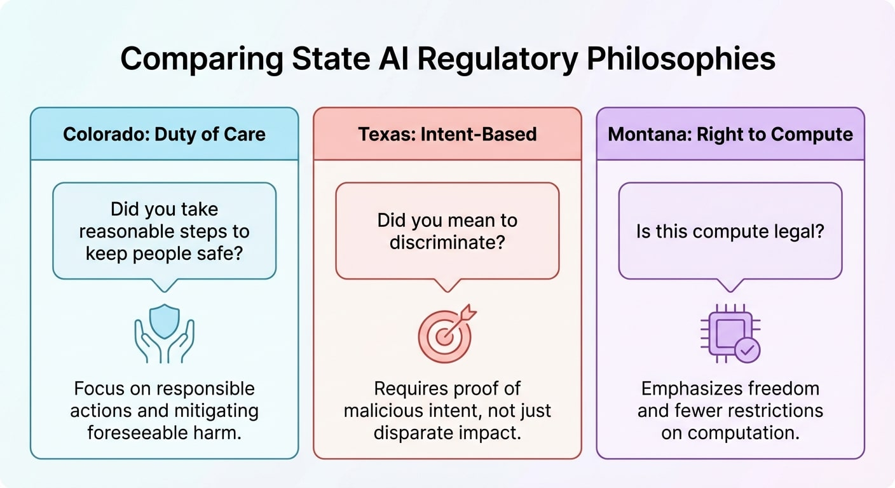

RadioAstronomy.io used AI like most small teams do six months ago: we had accounts with different vendors, informal usage policies, and the belief that "GPT Business solves everything."  It worked until we started making datasets that other researchers were using, citing, and building on.

You see, as a Citizen Scientist, I believe that you are responsible for the veracity and transparency of your research. Our research papers, our datasets, are cited in downstream work and they are used on Kaggle for learning. We feel that carries a high standard of responsibility.

That's why we made a system for governing. The [NIST AI RMF Cookbook](https://github.com/vintagedon/nist-ai-rmf-cookbook) shows what we use to run a six-person AI-native team: policies, risk scenarios, 130+ model cards, and framework integration that has a reasonable per month cost. No budgets for businesses. No armies of consultants. Just a systematic, repeatable, auditable process.

 This is what I learned.

 NIST tells you what to do, not how to do it.

 The first thing that surprised me was that NIST AI RMF is *descriptive* and not *prescriptive*. It tells you what to think about—risks, trustworthiness traits, and the effects on stakeholders—and why it matters. You get to decide how to carry out the plan.

 This is both freeing and annoying. It gives you freedom because you can change it to fit your needs. It's frustrating because most businesses skip over the framework in search of a checklist that doesn't exist. And let's be honest, who doesn't just want a checklist?

 The four main functions (Govern, Map, Measure, Manage) tell you what kinds of things you need to do. They don't tell you how to do them with three engineers and a Google Drive that everyone can use.

 Four Frameworks, One System

 We fixed this by putting together four frameworks, each of which adds something new:

 

 The "what" part of NIST AI RMF 1.0 is the governance structure. Four functions, traits of trustworthiness, and things to think about for stakeholders. The skeleton is what it is.

 The "how" is given by CIS-RAM (Risk Assessment Method). A method that can be used again and again is to find, evaluate, rank, respond, and keep an eye on things. It turns NIST's functions into things you can actually do.

 CIS Controls v8.1 IG1 gives a technical baseline with 56 specific controls that small teams can implement without having to hire security staff. Basic cyber hygiene linked to the principles of AI trustworthiness.

 Colorado SB-24-205 makes the rules more clear. Definitions of "high-risk AI systems" for operational purposes, requirements for impact assessments, and obligations for disclosure. Instead of abstract ideas, use real language.

 Governance structure, risk methodology, technical controls, and regulatory alignment all work together. A complete system with realistic resources.

## Why Colorado

 This is where I need to be clear about how our values match up.

 We *picked* Colorado's framework. We don't have to follow it because we're a research organization, not a business that deploys in Colorado. We chose to use it because its philosophy is in line with how we already think about our work.

 

 The Colorado model asks, "Did you take reasonable steps to keep people safe?"  That's a framework for duty of care. It asks if you did the right thing and if you took the right steps.

 [Texas TRAIGA](/p/texas-traiga-intent-based-model/) asks a different question: "Did you mean to discriminate?"  That's a framework based on intent. You can't just show disparate impact; you also have to show malicious intent.

 [Montana's Right to Compute Act] (/p/federal-preemption-failure-state-divergence/) asks again, "Is this compute legal?"  Few rules, lots of freedom.

 Duty of care "resonates" for a team that makes scientific datasets that other researchers use and cite. Before we publish, we already ask ourselves, "Will this method hurt users down the line?"  The way Colorado wrote it made it clear what we were trying to do.

 A gaming startup that wants to improve engagement metrics might want to use Texas's model. An AI business in Montana could become libertarian. These aren't bad choices; they're just different situations with different values.

 What's ours and what's portable

 The cookbook makes these clear:

 What changes depending on where you are:

- The risks and threats that are specific to you
- The tools and infrastructure you have - The limits on your budget and resources
- The rules that govern your business

 What stays the same (the framework):

- The kinds of evidence you need - Four main tasks (Govern, Map, Measure, Manage) - The steps and tools for managing risk
- A methodical way of running things

 We have a six-person team, use Google Workspace Enterprise, do astronomy research, use public datasets, and have a zero-trust architecture. That's what we're talking about.

 Our templates can be changed to fit your needs; they are based on patterns that work with any stack. Model card structures, formats for risk scenarios, and policy frameworks. Take what you need and leave the rest.

 It's not a bug if your implementation looks different from ours. That's how the framework is supposed to work.

## The Argument for Downstream Responsibility

 Most people ask me, "Why bother if you're not regulated?"

 Because we make work that is important. People download our improved datasets. People copy our method. Our spectral analysis has an effect on other studies. If we send out bad data or biased preprocessing, it spreads.

 Governance is more than just checking boxes for compliance. It's about being disciplined at work so that it has an effect on the future. We hold the same standards for the AI tools we use to make that data as we do for the data itself: version control, peer review, and reproducibility.

 We made what we were already trying to do more official. The framework only gave us a way to organize our thoughts and talk about them.

## To begin

 The [cookbook](https://github.com/vintagedon/nist-ai-rmf-cookbook) can help you make what you're already doing more formal if you're using AI productively but not managing it formally. Check out the risk scenarios in `policies-proxmox-cluster/risk-scenarios/`. If three or more of them apply to your business, you would benefit from systematic governance.

 If you're starting from scratch, the templates give you a framework without making you come up with new ways to format documents.

 Our `docs/framework-decision-rationale.md` explains what we chose, what we didn't choose (ISO 42001, SOC 2, FedRAMP), and why if you're looking at frameworks.

 We aren't setting the standard. We're sharing a standard that came from our values, our situation, and our limits. Change as needed.
