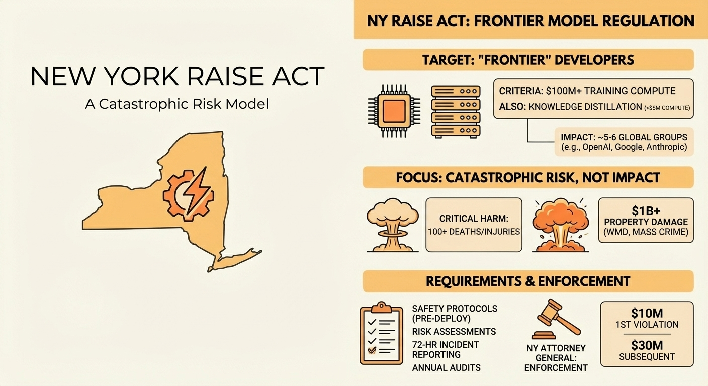

The New York legislature passed the Responsible AI Safety and Education Act in June with strong support from both parties: 58-1 in the Senate and 119-22 in the Assembly. A new industry PAC is spending millions to attack the bill's main sponsor while it sits on Governor Hochul's desk.

It's interesting how strong the opposition is, given how narrow the law is.

## A Different Model of Threat

RAISE doesn't look like any of the other state AI laws we've seen this year, like Colorado's SB-24-205. Colorado has broad rules for the deployment layer, which includes any company that uses AI to make important decisions. New York, on the other hand, focuses on the development layer at its highest level.

The limit is $100 million in computing costs to train a model. There are probably only five or six groups like that around the world. OpenAI, Anthropic, Google, Meta, and maybe DeepSeek. Your business isn't covered. Not mine either.

The definition of harm is just as clear. "Critical harm" means that 100 or more people died or were seriously hurt, or that property damage of at least $1 billion was caused by either weapons of mass destruction or criminals acting on their own. We're not talking about bias in resume screening or loan discrimination. We're talking about bioweapons that use AI and crime that happens on a large scale.

This is a model of catastrophic risk, not one based on impact. This is different from the Blue Model/Red Model divide I've been following in this series.

## What It Actually Requires

For the few developers who are covered, RAISE says:

- You must have written safety and security protocols before deploying frontier models
- Risk assessments for situations that could cause catastrophic harm  
- Reporting incidents within 72 hours if something goes wrong - annual independent audits
- Published (redacted) versions of safety protocols

The Attorney General has the power to enforce the law with real teeth: $10 million for the first violation and $30 million for each violation after that.

There is also a provision for knowledge distillation. You are also covered if you train a smaller model on the outputs of a frontier model and spend more than $5 million on compute. That is meant to stop people from going around the threshold.

The Political Fight

The opposition is very strong for a law that only affects a few companies.

Leading the Future, a bipartisan PAC funded by tech companies, said it would run a campaign against Assemblymember Alex Bores, who is running for Congress and is the bill's sponsor. They said they would spend $10 million. The argument is that regulating AI at the state level makes a "patchwork" that will help China win the AI race.

Bores, who has a master's degree in computer science and has worked in tech for almost ten years, has been clear: "If they are scared of people who know their business regulating their business, they are telling on themselves."

The national debate over preemption is getting more intense. In November, the White House wrote an executive order to stop state AI laws. House Republicans tried to sneak language about preemption into the NDAA. So far, these efforts have not worked; in July, the Senate took away the moratorium provision by a vote of 99-1. But the pressure is still on.

 What Happens Next

Governor Hochul has until the 2026 legislative session to sign or reject it. She has said that she wants New York to be a leader in both innovation and accountability, but that's the kind of language that could mean anything.

If she signs, New York will be the first state to put frontier model safety rules into place. If she vetoes it, it's another SB 1047—a bill that passed the legislature but failed to get approval from the governor.

No matter what, the fact that so much time and money is being spent to kill a law that only affects a few organizations around the world shows you what the industry thinks about regulation.

---

*This is part of an ongoing series on US state-level AI regulation. Previous posts covered [Colorado's Duty of Care framework](/p/colorado-sb-24-205-duty-of-care), [Texas TRAIGA's intent-based model](/p/texas-traiga-the-intent-based-model), [Montana's Right to Compute](/p/montana-the-right-to-compute-constitutional-model), and [federal preemption failure](/p/federal-preemption-failure-state-divergence).*
