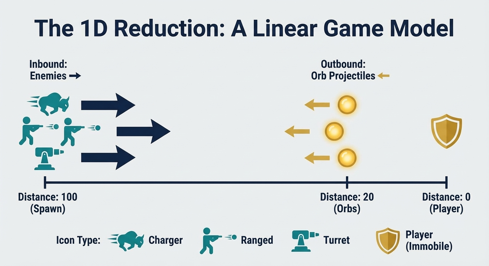
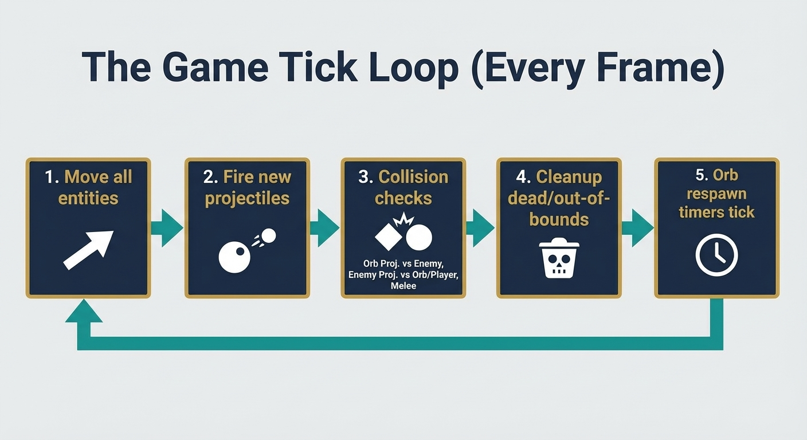

I've been a gamer my whole life.  Roguelites are one of my favorite types of games. The cycle of risk, reward, and slowly getting better at something really speaks to me.  Also why I still remain a tower defense fan.  I've seen the genre change from Spelunky to Hades, and I've noticed something.

All bullet-hell roguelites end the same way.

You have no way out.  Too much.  No room to move.  You stand your ground and fight until you win or die.  All that kiting and positioning comes to an end with a last stand.

So here's the thesis for the design: go straight to the end state.  You are NOT moving.  That's not a limit; that's how the game works.

## The Big Picture

The core loop I'm making is just one room in a bigger picture.  Think of an old-school dungeon crawl with the structure of Slay the Spire.  Each choice that branches out is a room in a dungeon.  A store, maybe.  An event might happen.  The branching paths ARE the choice of rooms.

Clear a room, then go deeper.  Things get harder.  In the end, you die.

Old skool.

But first, I need to make sure that the core combat loop works before I learn Godot and choose an engine.  Does the math make the choices interesting?  Does the game feel like you can win, but it's tense?

I'm not a game developer; I'm a systems engineer.  But a game loop is just a series of steps: inputs, state changes, and outputs.  I know how to make models of processes.  So, I'm making a headless Python simulation to answer these questions with data before I write any engine code.

## The 1D Reduction

Here's the modeling decision that makes everything tractable: collapse it all to to a 1d axis. Think about looking at the game from the top down.

The player is at distance 0 and immobile.  Enemies appear at a distance of 100 and move toward you.  Your defensive line, which is a ring of autonomous orbs, holds at a distance of 20.

This isn't a way to make the end game easier.  It's an intentional abstraction for checking.  If the loop works in one dimension, it makes the whole loop calculation easier.

## The People

Player: 100 hit points.  Set in the middle.  It dies when HP reaches zero.  That's all there is—no skills, no movement.  Your orbs do the work.

Three orbs, each holding the line at a distance of 20.  Each one shoots projectiles out, does melee damage to enemies that get close to the ring, and can be broken.  After 60 ticks, an orb that dies comes back to life.  Your only protection is the orb ring.

Chargers are the main enemy.  20 HP, 2 speed, and it walks right at you.  Melees orbs at the ring and melees you in the middle.  Just pressure.

Ranged: moves slowly and is weak (15 HP), but it shoots projectiles as it moves.  Makes the bullet hell part.

Turrets: Stay still at spawn distance.  Tanky (25 HP) with projectiles that do a lot of damage.  You have to kill them with outgoing fire while you deal with the rush.

## The Tick Loop

Every tick goes through the same steps:

1. Move all entities by their velocity
2. Fire new projectiles (orbs and ranged enemies on cooldown)
3. Collision checks in order: orb projectiles vs enemies, enemy projectiles vs orbs, enemy projectiles vs player, melee resolution
4. Cleanup dead entities and out-of-bounds projectiles
5. Orb respawn timers tick down

The order is important.  Swept collision detection makes sure that fast projectiles don't go through targets.  No floats until the final analysis; all math is done with integers.

## What I'm Making

A headless simulation that plays more than 10,000 games and gives you structured data.  During each run, there are 10 waves, and the number and type of enemies gets harder each time.  A draft system (more on that in Part 2) makes strategic choices between waves.

The output is a dataset that is ready for Kaggle and answers specific questions.  What is the curve for survival?  Which strategies are the best?  Where do most runs end?

This is a Monte Carlo test of the game's design.  I fix the loop before I touch an engine if the numbers say it's broken.

## The AI-Assisted Development Angle

I want to make it clear that I'm not a game developer.  I've never sent a game.  But I write scripts and code daily, like astronomy pipelines, Ansible automation, CLI agents, and cron jobs.  This means I can validate the code the AI uses, have some fun and learn some game design.

This project is in my area of growth.  I can't come up with game loop math on my own, but I can check it, change it, and refactor it.  With Gemini CLI, Claude Code, and good HITL discipline, I can work in related fields while still being strict about engineering.

This isn't vibe coding.  This is AI-assisted software engineering, where agents add to what a person can do instead of taking over their judgment.

 Follow the work log.
*Next: Part 2 covers the hate draft system, the data science angle, and what I'm validating this weekend.*
