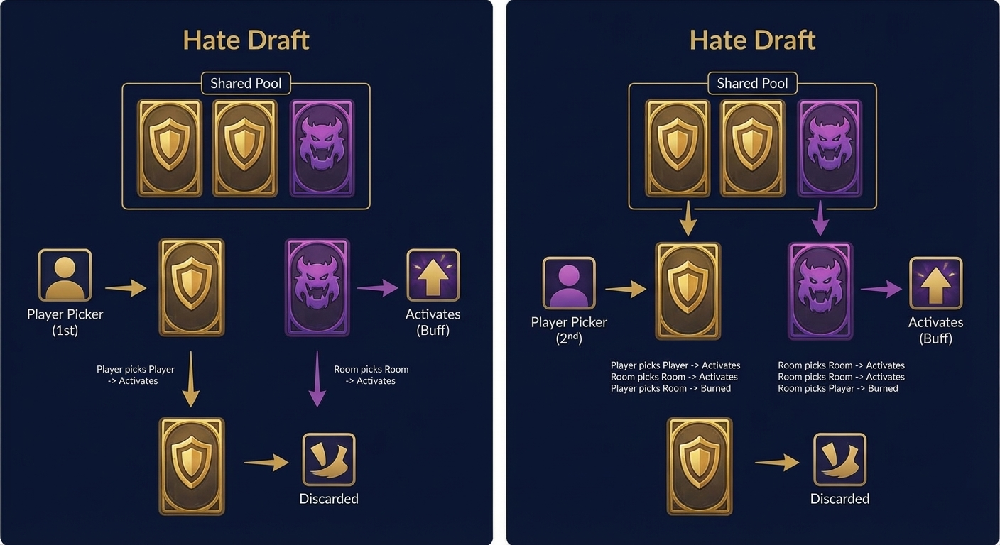
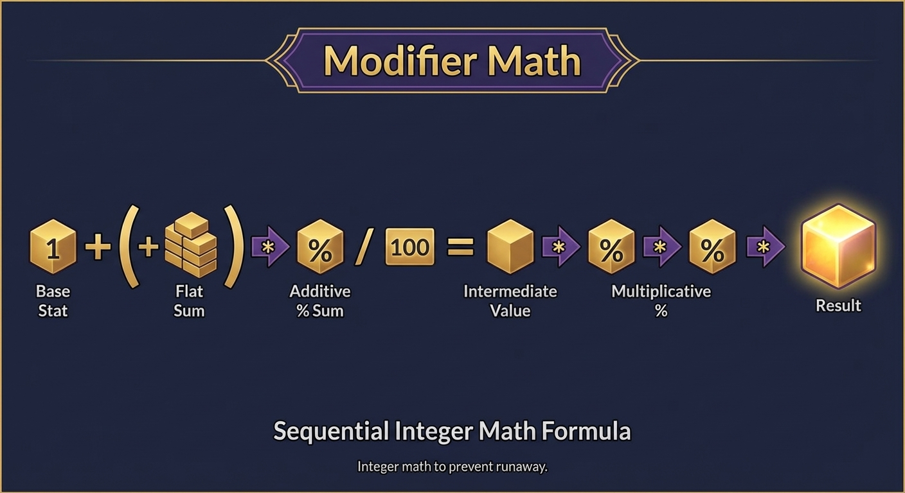

In [Part 1](/posts/orb-weaver-part-1), I explained the combat model: a 1D version of a stationary tower defense roguelite for testing. Enemies march in, orbs hold the line, and you either live or die.

But just staying alive isn't interesting. The strategic layer is what lets you play a roguelite again and again. That's where the hate draft comes in.

The Hate Draft

Both Player and Room pick modifiers from a shared pool between each wave. Three cards are drawn. The first person to pick one gets it. The second picker takes one of the two left. The last card is thrown away.

Here's the catch: cards are locked to a faction.

## The Hate Draft

Between every wave, both sides—Player and Room—draft modifiers from a shared pool. Three cards are drawn. First picker takes one. Second picker takes one from the remaining two. The last card is discarded.

Here's the twist: cards are faction-locked.



This is the hate draft. You can give up your pick to stop your opponent from getting a strong card.

The problem comes from the way the hand is made up. If you're the first picker and have two Room cards and one Player card, do you take your buff (which gives the Room their best card) or burn their best option (which gives you nothing while they still get their second-best)?

A 50/50 roll decides who gets to pick first each wave. Going first with a bad hand makes you make tough decisions. That's what the design is meant to do.

## The Modifier Math

Modifiers stack according to a fixed formula: flat bonuses first, then additive percentages, then multiplicative percentages. Integer math throughout to prevent stat runaway.



```markdown
result = (base + flat_sum) * (100 + add_pct_sum) // 100
# then apply mult_pct sequentially
```

Player-side modifiers buff orb HP, damage, fire rate, count. Room-side modifiers buff enemy HP, speed, spawn count. The pool is roughly 50/50 to ensure dilemma hands occur frequently.

However, I didn't derive this math myself.

## How GDR Scaffolded the Design

Here's where methodology matters. I've been playing roguelites for decades. I understand game feel intuitively—when a run feels tight, when a mechanic creates real choices. But I couldn't write the modifier formula cold, or calculate shots-to-kill ratios across wave scaling.

So, I used Gemini Deep Research to work it out.

I brought the design thesis ("skip to the end state"), the main idea for the game (faction-locked drafting), and the questions I needed to be answered. GDR worked on the math for modifiers, tuning enemy stats, and wave composition curves. The simulation brief I'm working on comes straight from those sessions.

This is an example of the zone of proximal development. I can't figure it out on my own, but with the right scaffolding, I can understand it. When GDR suggested a wave scaling table, I could read it and say, "The first wall should be wave 5, not wave 3." When the modifier formula came back, I understood why adding before multiplying stops exponential blowup.

The same pattern holds true for implementation. An agent might make the tick loop almost complete, but I'll step in to clean it up, ask for explanations, and find edge cases. Not replaced by AI, but helped by it.

## The Data Science Angle

At some point while I was working on the simulation, it hit me: this is a way to make a dataset.

Every run gives you structured output, like draft decisions, wave outcomes, and survival curves. You can make a new Kaggle dataset by running 10,000 simulations that look into questions like:

- Is the first-pick advantage more than 55%? (Shows that the coin flip is too important)
- Which modifier has the biggest difference in win rate when picked?
- Is the deny strategy ever better than the greedy one?
- What wave do most runs end on?
- What hand combinations make it hardest to decide?

The schema for the output:

runs.csv: run_id, seed, player_policy, room_policy, outcome, waves_survived, final HP  
drafts.csv: run_id, wave, first_picker, hand composition, picks, activation results  
waves.csv: run_id, wave, enemies spawned/killed/leaked, orbs lost, ticks elapsed

Reproducible by seed. Self-describing. Pandas-ready. And Bob's your uncle, you have a dataset.

## What I'm Validating This Weekend

The simulation needs to answer whether this loop works. Specific success criteria:

- 10,000 runs done without any mistakes
- The win rates are very different depending on the bot policy (random, greedy, or deny).
- Deaths happen mostly in waves 5–7, which is where the game is meant to get harder.
- At least one bad strategy comes up (which tells me where to tune)

If the data shows that the hate draft doesn't make real choices, I fix the mechanic. I change the scaling if wave 5 is a brick wall with a 90% chance of death. Monte Carlo comes first, and the engine comes second.

## The Stack

For implementation: Python 3.11 or higher, only the standard library, integer math, and seeds that don't change. Use Gemini CLI and Claude Code to make and review. VSCode with completion agents for real-world refactoring.

This sits in my zone of proximal development. I code pipelines and automation daily—I'll understand the game loop code even if I didn't write every line. The goal is shipping a working simulation with proper HITL discipline, not proving I can hand-roll collision detection.

Work log starts this weekend. Results and the Kaggle drop coming next week.

*Previously: [Part 1](/posts/orb-weaver-part-1) covers the game design thesis and 1D combat model.*
