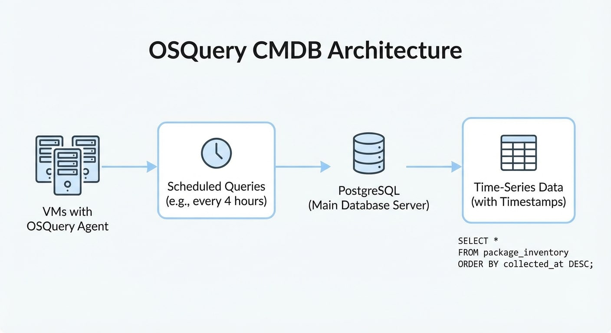
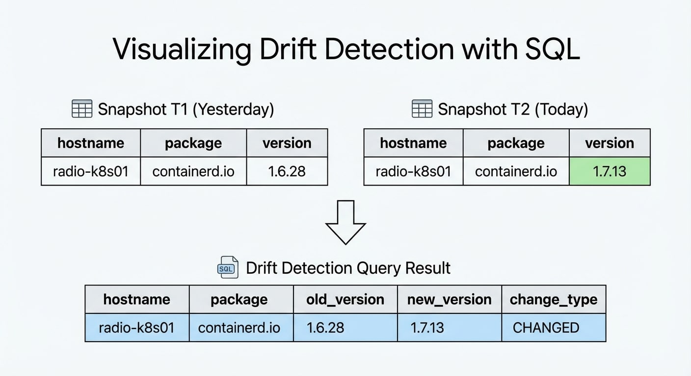

We tell ourselves sweet lies when we use traditional CMDBs.  You fill them out once, maybe update them every three months if you're disciplined, and in a few weeks they don't match reality anymore.  The VM you got rid of last month?  Still in the CMDB.  The package you updated yesterday?  CMDB says it's three versions behind.

Here's another way to do it: ask the infrastructure what state it's in and save the results with timestamps.  Your CMDB is no longer a static document; it's a time series.  Drift detection is now a SQL query that compares a snapshot from today to one from yesterday.

## OSQuery: SQL for Your Computer's Operating System

OSQuery shows the state of the operating system as SQL tables.  There are more than 270 tables across Linux, macOS, and Windows that show processes, packages, users, network connections, mounted filesystems, and kernel modules.  You ask your infrastructure questions in the same way you ask a database questions.

```sql
SELECT name, version, source FROM deb_packages WHERE name LIKE 'openssl%';
```

This rather simple query will return all installed OpenSSL packages on a Debian/Ubuntu system.  Run it on a bunch of VMs, save the results, and you'll have a list of all your packages.  You can find any changes by running it again in four hours and comparing the results.

## The Architecture

The idea is simple:

1. Each VM has an OSQuery agent that runs as a service and is set up with Ansible.
2. Every four hours, `osqueryd` runs scheduled queries
3. The results are sent to PostgreSQL on the main database server.
4. Timestamps on each row make it possible to run historical queries.



Your CMDB turns into:

```sql
SELECT hostname, name, version, collected_at 
FROM package_inventory 
WHERE name = 'openssh-server'
ORDER BY collected_at DESC;
```

That shows you OpenSSH versions across your fleet over time. When did that upgrade happen? Who still hasn't patched? The data answers the question.

## What You're Actually Collecting

My cluster runs 27 VMs across 7 Proxmox nodes—mix of Ubuntu 24.04 and Windows Server 2025. Here's what a reasonable collection scope looks like:

System Identity

- `system_info`: hostname, CPU, memory, OS version
- `interface_addresses`: IP assignments per interface
- `os_version`: detailed OS build information

Security Posture

- `users`, `groups`: account inventory
- `logged_in_users`: active sessions
- `listening_ports`: network attack surface
- `iptables`: firewall rules (Linux)
- `certificates`: SSL/TLS cert inventory

Software State

- `deb_packages` / `programs`: installed software
- `kernel_info`, `kernel_modules`: kernel state
- `docker_containers`, `docker_images`: container inventory
- `systemd_units` / `services`: service configuration

Resource Usage

- `mounts`, `disk_info`: storage configuration
- `processes`: running process snapshot
- `memory_info`: memory allocation

That's maybe 15-20 tables per collection cycle. At 27 VMs every 4 hours, you're looking at ~160 snapshots per day, each containing structured data about your entire fleet.

## The Drift Detection Query

Here's where time-series pays off. Want to know what changed in the last 24 hours?



```sql
WITH current AS (
  SELECT hostname, name, version 
  FROM package_inventory 
  WHERE collected_at = (SELECT MAX(collected_at) FROM package_inventory)
),
previous AS (
  SELECT hostname, name, version 
  FROM package_inventory 
  WHERE collected_at = (
    SELECT MAX(collected_at) FROM package_inventory 
    WHERE collected_at < (SELECT MAX(collected_at) FROM package_inventory)
  )
)
SELECT 
  COALESCE(c.hostname, p.hostname) as hostname,
  COALESCE(c.name, p.name) as package,
  p.version as old_version,
  c.version as new_version,
  CASE 
    WHEN p.name IS NULL THEN 'ADDED'
    WHEN c.name IS NULL THEN 'REMOVED'
    ELSE 'CHANGED'
  END as change_type
FROM current c
FULL OUTER JOIN previous p 
  ON c.hostname = p.hostname AND c.name = p.name
WHERE c.version IS DISTINCT FROM p.version;
```

That surfaces every package addition, removal, or version change across your fleet. No manual tracking. No "did anyone update that server?" questions. The data is there.

## Sample Output: What Drift Looks Like

Run that query on a Tuesday morning:

```
hostname        | package          | old_version | new_version | change_type
----------------+------------------+-------------+-------------+------------
radio-k8s01     | containerd.io    | 1.6.28      | 1.7.13      | CHANGED
radio-k8s02     | containerd.io    | 1.6.28      | 1.7.13      | CHANGED
radio-k8s03     | containerd.io    | 1.6.28      | 1.7.13      | CHANGED
radio-docker02  | grafana          | 10.2.3      | 10.4.1      | CHANGED
radio-pgsql01   | postgresql-16    | 16.1        | 16.2        | CHANGED
radio-dev01     | code             | NULL        | 1.85.1      | ADDED
radio-agents01  | osquery          | 5.19.0      | 5.20.0      | CHANGED
```

The K8s nodes got a coordinated containerd upgrade. Grafana updated on one docker host. PostgreSQL patched. Someone installed VS Code on the dev server. OSQuery itself updated on agents01.

That's your change log for the last collection cycle. Extend the query to 7 days, 30 days, whatever retention your storage supports.

## Why This Beats Traditional CMDBs

Accuracy: Data comes from the systems themselves, not humans remembering to update a spreadsheet.

History: Every state is preserved. "What was running on that server three weeks ago?" is answerable.

Automation-friendly: It's SQL. Feed it to Gemini for synthesis, pipe it to alerting systems, join it with other data sources.

Drift as a first-class concept: Change isn't something you track separately—it's inherent in the time-series structure.

Low maintenance: Once deployed, the system maintains itself. No quarterly "CMDB cleanup" projects.

## The Broader Pattern

This is one workflow in a larger automation architecture. The OSQuery results land in PostgreSQL alongside Prometheus metrics, Loki log aggregations, and compliance scan outputs. Gemini CLI synthesizes across these sources to produce daily cluster health reports.

The CMDB isn't a separate system anymore—it's one table family in your operational data platform.

---

*OSQuery is available at [osquery.io](https://osquery.io). The schema documentation at [osquery.io/schema](https://osquery.io/schema/5.20.0/) is excellent for exploring available tables.
