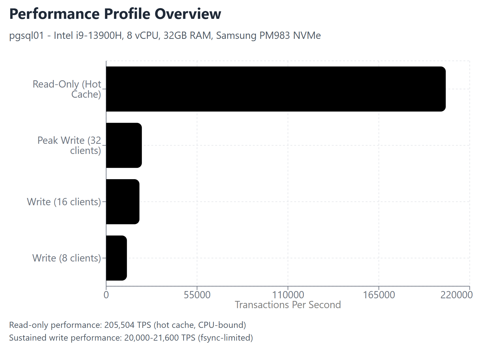
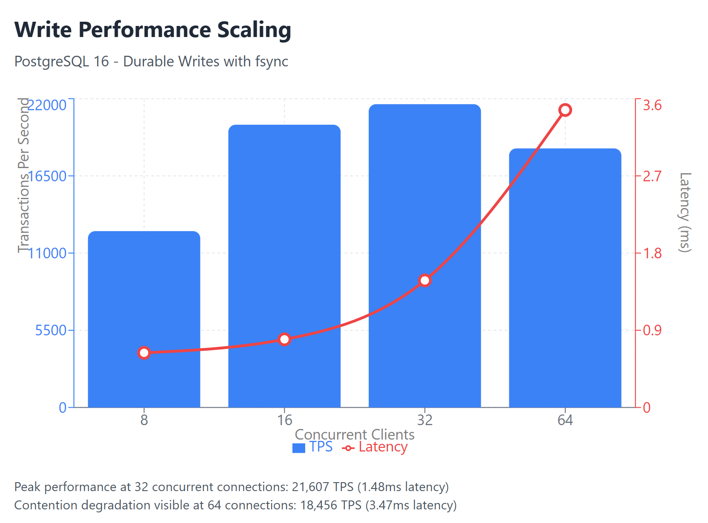

For my astronomy research, I use PGSQL and have a primary big data server. Ran some benchmarks on pgsql01 and have been pleased with the results. The cluster runs on Samsung PM983 enterprise NVMe drive, and it shows.

The results exceeded expectations: 205,000 transactions per second for read-only queries and a sustained 21,600 TPS for durable writes.

## The Setup

Hardware platform is straightforward - an 8 vCPU VM (Intel i9-13900H host) with 32GB RAM and a Samsung PM983 1.92TB NVMe drive. PostgreSQL 16 with tuning focused on analytical workloads: 12GB shared buffers, 32GB max WAL size, and aggressive parallelization settings.

Drives are running as 'VirtIO SCSI single' with IOThread enabled for maximum performance.

Nothing exotic. Just solid enterprise-grade components configured properly.

## Read Performance: 205K TPS

```bash
sudo -u postgres pgbench -S -T 60 -c 16 -j 8 bench
```

Hot cache read performance hit 205,504 TPS with 0.078ms average latency. This is the theoretical ceiling - a working dataset entirely in memory, CPU-bound rather than I/O limited. For dashboard queries and analytical workloads where data fits in cache, this establishes the upper bound.



Read replicas for something like analytics offloading would be overkill. The primary can handle read-heavy workloads without breaking a sweat.

## Write Performance: 21K TPS Sustained

Durable write performance scaled cleanly from 8 to 32 concurrent connections:

- 8 clients: 12,564 TPS (0.637ms latency)
- 16 clients: 20,145 TPS (0.794ms latency)  
- 32 clients: 21,607 TPS (1.481ms latency) - peak
- 64 clients: 18,456 TPS (3.468ms) - contention degradation

The bottleneck is fsync operations, not storage bandwidth. The NVMe drive specs out at 480K IOPS for reads and 42K IOPS for writes - I'm using roughly 65K aggregate IOPS during peak write loads. That leaves 7-8x headroom before hitting storage limits.



## What The Numbers Mean

1. **Bulk loading is I/O efficient** - Storage can handle significantly higher throughput than current workload demands
2. **Write amplification is contained** - WAL commit pressure is the limiter, which is expected and manageable
3. **Multi-tenant friendly** - The NVMe has substantial headroom for additional VMs sharing the same storage

The 15-minute benchmark run showed minimal jitter in transfer rates. Performance was stable and predictable - my astronomy workloads can run hours, and I need solid, predictable performance.

## The Bottom Line

For its size and intended workload, pgsql01 performs exactly as it should. No surprises, no bottlenecks requiring architectural changes, and plenty of runway for dataset growth. Sometimes "boring" infrastructure performance is the best kind!
