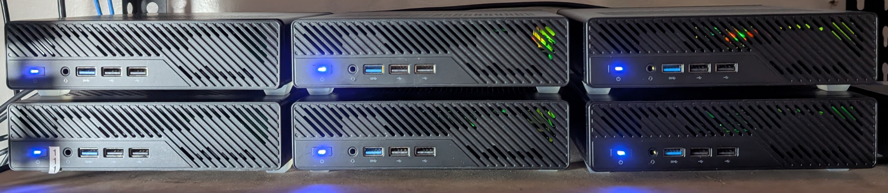
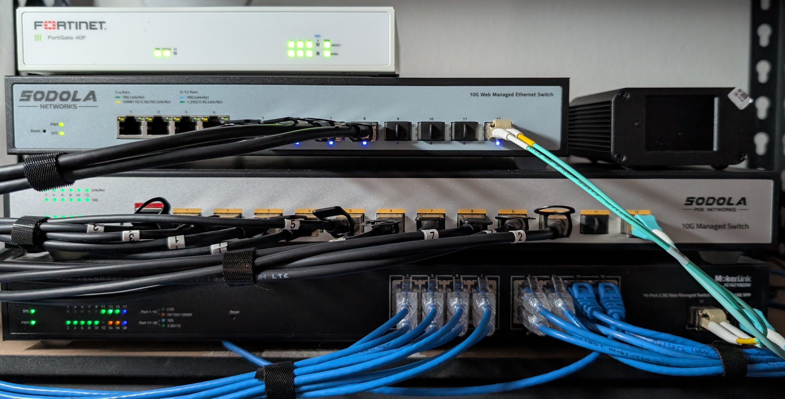

I run a 7-node Proxmox cluster with 144 cores, ~40 VMs, a 48-core Kubernetes cluster, and dual RTX A4000 GPUs. It's overkill for hobby projects, but, it's exactly right for what I'm actually doing: building Analysis Ready Datasets that transform computationally expensive operations into queryable databases.

The methodology works across domains. The same infrastructure that processes 6.4 million DESI galaxy spectra also powers the [Steam Dataset 2025](https://github.com/vintagedon/steam-dataset-2025) - 260,000+ video games with vector embeddings and graph analysis. Different data, same approach: front-load the computational cost, make the results queryable.

## Why Local Infrastructure in 2025?

The default answer to "I need compute for data science" is usually "spin up cloud VMs." For most people, that's correct. For my use case - building ARDs across multiple domains while developing expertise in AI governance frameworks like NIST AI RMF and CISv8 - local infrastructure makes more sense.

Three reasons:

Cost predictability: Running 144 cores 24/7 in Azure would be $3-5K/month. The hardware capital expense paid for itself in under a year, and now it's pure electricity costs (~$50/month;the choice to go SFF paid off). When you're doing long-running batch processing on multi-terabyte datasets, compute costs matter.

Compliance laboratory: My day job as an engineer at an MSP involves Azure GCC/GCC High environments and high-compliance workloads. The cluster is baselined to CISv8, integrated with Entra ID and serves as a working laboratory for understanding how these frameworks actually operate - not just reading documentation.

Data sovereignty: Some datasets are public (DESI, Steam), but the value-added products we're generating aren't ready for publication. Having full control over where data lives, who can access it, and how it's processed matters for research integrity and IP considerations.

## The Architecture

The cluster runs as static VMs supporting a central 48-core, 250GB RAM RKE2 Kubernetes cluster. The RTX A4000s are passed through to VMs and exposed to K8s workloads via device plugins. Data processing runs on Ray/Dask for distributed compute across the cluster.

Infrastructure services stack:

- Compute orchestration: RKE2 Kubernetes, Ray/Dask for distributed processing
- GPU acceleration: Dual RTX A4000 (16GB VRAM each) for ML inference and model training
- Access layer: NetBird ZTNA → Kasm Workspaces → corporate-joined Win11 VDIs or ephemeral Linux desktops
- AI tooling: OpenWebUI with DeepInfra models, MCP servers for agent orchestration
- Data persistence: Vector DB (embeddings), Graph DB (relationships), PostgreSQL for structured data
- DevOps: Gitea for repos, Portainer for Docker management, full monitoring/logging with 90-day retention

## Real Workloads: Analysis Ready Datasets

The cluster exists to create Analysis Ready Datasets (ARDs) - pre-computing the high-friction metrics that would otherwise be computationally prohibitive for individual researchers or analysts to generate on their own infrastructure.

The core problem is universal across domains: Raw data isn't analysis-ready. Running state-of-the-art processing on large datasets is computationally expensive. Deep learning inference requires GPU resources. Complex graph analysis demands substantial memory. Most researchers or data scientists can't afford to run these operations repeatedly.

The ARD approach front-loads this computational cost. Run the expensive operations once, store the results, and make them queryable. Transform "months of compute" into "seconds of database lookup."

### DESI Astronomical Spectroscopy

DESI Data Release 1 contains 6.4 million spectroscopic observations spread across 12,000+ Parquet files. A full Bayesian SED fit using Prospector can take hours per galaxy. Topological analysis to map cosmic web structures demands specialized software.

The three ARD layers:

- AI Layer: Spectral embeddings from foundation models (Universal Spectrum Tokenizer, AstroCLIP) enable similarity searches without re-running neural networks
- Physics Layer: Bayesian stellar population synthesis (stellar mass, SFR, age from Bagpipes), empirical spectral indices (emission lines, absorption features)
- Topology Layer: Cosmic web classification (void/sheet/filament/knot), distance to nearest filament, local density measurements

Query: "Find quenching galaxies in filaments with young stellar populations and strong emission lines" becomes a SQL JOIN operation across pre-computed columns.

### Steam Dataset 2025: Gaming Industry Analytics

The [Steam Dataset 2025](https://github.com/vintagedon/steam-dataset-2025) applies the same ARD methodology to a completely different domain. 260,000+ video games from Steam's catalog, processed into a multi-modal database architecture combining relational, document, and vector storage.

Same infrastructure, different data:

- Vector embeddings for semantic search across game descriptions and features
- Graph analysis of publisher relationships, genre clustering, and pricing patterns  
- Materialized analytics for market segmentation, trend analysis, and recommendation systems

The methodology is identical: transform expensive batch operations into queryable results. The cluster that processes galaxy spectra also processes game metadata - it's infrastructure for ARD creation, not astronomy-specific hardware.

## Infrastructure as Training Ground

The cluster doubles as a training environment for my IBM AI Engineer Professional Certificate and the hands-on component of my AI governance consulting work. When implementing NIST AI RMF controls, I can test them on actual ML pipelines with real data flows. When exploring explainable AI techniques like SHAP and LIME, I can validate approaches against real classification tasks.

The documentation pipeline is built for RAG - every deployment, configuration change, and architectural decision gets documented in markdown, indexed in a vector database, and made available to AI agents via MCP servers.

## The Hybrid Model Works

Running local infrastructure doesn't mean going full on-premises. The cluster integrates with Azure services where it makes sense:

- Azure Arc for management plane and policy enforcement
- Azure Key Vault for secrets management and certificate lifecycle
- Azure Container Registry for artifact storage with vulnerability scanning
- Entra ID for identity management and conditional access policies

This hybrid approach gets the benefits of cloud services (managed identity, policy enforcement, vulnerability scanning) without the cost of running compute workloads in Azure. It's the architecture pattern I recommend to clients who need to balance cost control with enterprise governance requirements.

## What's Next

Current infrastructure handles multi-domain workloads comfortably. Next phase involves expanding the DESI analysis to include AGN environmental studies and exploring UV spectroscopic diagnostics. On the Steam side, we're building recommendation systems that leverage the vector embeddings for semantic similarity rather than traditional collaborative filtering.

The ARD methodology is domain-agnostic. Same infrastructure, same approach, different datasets. That's the point - build the capability to transform expensive compute into queryable results, then apply it wherever the data lives.

For now, the cluster does exactly what it's supposed to: process large-scale datasets efficiently while serving as a laboratory for professional AI governance work. Sometimes the best tool for the job is a rack of servers in your office, properly secured and managed.

---

*Full technical documentation and deployment guides available at the [Proxmox Astronomy Lab GitHub repository](https://github.com/Proxmox-Astronomy-Lab/proxmox-astronomy-lab). Steam Dataset 2025 available at [vintagedon/steam-dataset-2025](https://github.com/vintagedon/steam-dataset-2025).*
