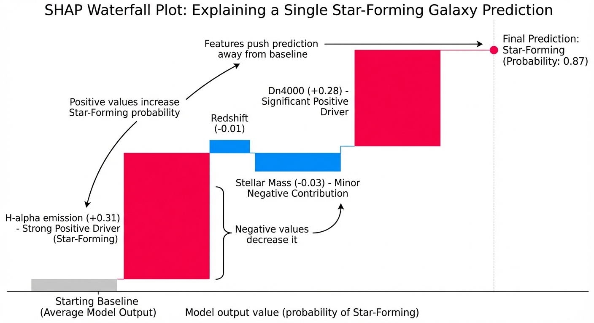

One of my fields of interest is Explainable AI (xAI). Recently got a chance to apply it to astronomy data.

I trained a random forest classifier on DESI galaxy data to predict star-forming vs quiescent galaxies. It hit 94% accuracy on the test set. Great. But I had no idea *why* it was making those predictions. Had I just gotten lucky, or was it actually using the right features?

The model used eight features: Dn4000 (4000Å break strength), H-alpha emission, stellar mass, redshift, morphology, color indices, and velocity dispersion. All of them correlate with star formation to some degree. But which ones actually drive the predictions?

## Without Explainability

Here's the standard workflow - train model, make predictions, check accuracy:

```python
from sklearn.ensemble import RandomForestClassifier
from sklearn.metrics import accuracy_score

# Initialize random forest with 100 decision trees
# Each tree votes on the classification, majority wins
# random_state=42 ensures reproducible results across runs
rf_model = RandomForestClassifier(n_estimators=100, random_state=42)

# Train on labeled galaxy data
# X_train: feature matrix (Dn4000, H-alpha, mass, redshift, etc.)
# y_train: known classifications (0=quiescent, 1=star-forming)
rf_model.fit(X_train, y_train)

# Generate predictions on unseen test data
# Model has never seen these galaxies during training
y_pred = rf_model.predict(X_test)

# Calculate accuracy: what percentage did we classify correctly?
accuracy = accuracy_score(y_test, y_pred)
print(f"Accuracy: {accuracy:.2%}")  # 94%

# Problem: We know the model works, but we don't know WHY
# Which features is it actually using to make decisions?
# feature_importances_ gives global averages, but not per-galaxy explanations
# ¯\_(ツ)_/¯
```

I can look at `feature_importances_` from scikit-learn, which gives a global average, but that doesn't tell me why the model predicted *this specific galaxy* as star-forming. Did it see strong H-alpha emission? Low Dn4000? Something else?

## With SHAP

Adding SHAP takes three lines of code:

```python
import shap

# TreeExplainer is optimized for tree-based models (random forests, XGBoost, etc.)
# It computes exact SHAP values efficiently using the tree structure
explainer = shap.TreeExplainer(rf_model)

# Calculate SHAP values for every feature, every galaxy in test set
# SHAP values represent each feature's contribution to pushing the prediction
# away from the base value (average model output) toward the final prediction
shap_values = explainer.shap_values(X_test)

# Visualize explanation for a single galaxy
# Waterfall plot shows cumulative effect of each feature
# Positive values push toward "star-forming", negative toward "quiescent"
shap.waterfall_plot(shap.Explanation(
    values=shap_values[1][0],  # SHAP values for first test galaxy, star-forming class
    base_values=explainer.expected_value[1],  # Average model prediction (baseline)
    data=X_test.iloc[0],  # Actual feature values for this galaxy
    feature_names=X_test.columns  # Human-readable feature names
))

# Result: Now we can see exactly which features drove this specific prediction
# E.g., "H-alpha = 45.2 → +0.31 toward star-forming"
#       "Dn4000 = 1.15 → +0.28 toward star-forming"
#       "Mass = 10.8 → -0.03 toward quiescent"
```



The waterfall plot shows exactly how each feature pushed the prediction toward or away from "star-forming" for this specific galaxy.

## What I Learned

The SHAP analysis revealed something I should have known but didn't fully appreciate: Dn4000 and H-alpha are doing 90% of the work.

For star-forming galaxies, the model looks at:
1. H-alpha emission (strong → star-forming)
2. Dn4000 index (weak break → young stars → star-forming)
3. Everything else contributes marginally

For quiescent galaxies, the pattern inverts:
1. Dn4000 (strong break → old stars → quiescent)
2. H-alpha (weak or absent → no ongoing formation)
3. Stellar mass matters slightly (massive galaxies tend to be quiescent)

The features I thought would matter more - morphology, color - barely influence predictions. The model learned what astrophysicists already know: spectral features directly trace star formation better than indirect proxies.

## Why This Matters for Research

This isn't just about understanding the model. It's about validating the model is learning physics, not artifacts.

If SHAP had shown that *redshift* was the primary driver, I'd know something was wrong - redshift shouldn't directly determine star formation activity. That would suggest the model found a spurious correlation (maybe the training sample was imbalanced by redshift).

If *stellar mass* dominated, it would suggest the model learned a correlation (massive galaxies are often quiescent) but missed the underlying mechanism (why they're quiescent - they stopped forming stars, which we measure via Dn4000 and H-alpha).

Instead, SHAP confirmed the model is using the right features in the right way. It's measuring star formation directly through spectral diagnostics, exactly as it should.

## The Practical Workflow

For DESI analysis, this changes how I approach model development:

1. Feature selection: If SHAP shows a feature contributes <1% across all predictions, drop it. Simpler models are better models.

2. Physics validation: Check that high-importance features align with physical intuition. If they don't, investigate why.

3. Error analysis: For misclassified galaxies, use SHAP to see what confused the model. Often reveals edge cases or mislabeled training data.

4. Visualization: SHAP waterfall plots are more interpretable to non-ML astronomers than "the random forest says this galaxy is star-forming with 87% confidence."

## The Nano Banana Shortcut

Side note: I've been using [nano banana 3](https://aistudio.google.com/prompts/nano-banana-3) to generate SHAP visualizations directly from prompts. Feed it a dataset description and the model architecture, ask for a SHAP analysis, and it produces working code with properly formatted plots.

Still writing matplot code, but the nano banana shortcut saves me hours when I'm just spitballing numbers.

## Bottom Line

SHAP adds three lines of code and answers the question every ML practitioner should ask: "Why did my model make this prediction?"

For astronomy applications where physics intuition exists, explainability isn't optional - it's how you validate the model learned physics rather than noise. SHAP makes that validation straightforward.

The galaxy classification model works because it learned to weight spectral features correctly. I know this because SHAP showed me exactly what it's doing. That's worth three lines of code.

---

*SHAP (SHapley Additive exPlanations) is model-agnostic but works particularly well with tree-based models. Install with `pip install shap`. Documentation at [shap.readthedocs.io](https://shap.readthedocs.io).*
