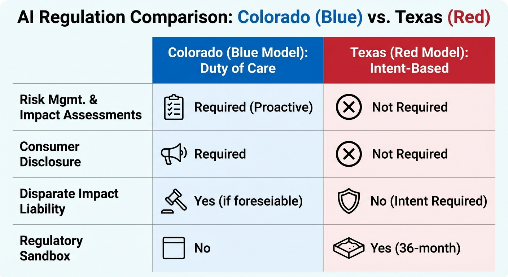

The emerging split in US state AI regulation isn't just political, it's philosophical. Colorado asks: "Did you take reasonable care to prevent discriminatory outcomes?" Texas asks: "Did you intend to cause harm?"

These are fundamentally different questions with fundamentally different compliance implications. Governor Greg Abbott signed the [Texas Responsible AI Governance Act](https://capitol.texas.gov/BillLookup/History.aspx?LegSess=89R&Bill=HB149) (TRAIGA) on June 22, 2025, making Texas the clearest implementation of what I call the "Red Model" - intent-based AI regulation that focuses on bad actors rather than unintended consequences.

## The Red Model Philosophy

The Red Model assumes AI systems are generally beneficial and regulation should target deliberate misuse. If you didn't intend to discriminate, then you shouldn't face liability for disparate outcomes that emerge from your AI system. The burden should be on regulators to prove malicious intent, not on developers to prove they prevented every foreseeable harm.

This contrasts with Colorado's "Blue Model" - duty of care regulation that holds developers and deployers responsible for exercising reasonable care to prevent algorithmic discrimination, regardless of intent. Under Colorado's framework, good intentions aren't a defense if your system produces discriminatory outcomes you could have foreseen and mitigated.

Texas explicitly rejected the Blue Model approach. The statute states: "Disparate impact alone is not sufficient to show intent to discriminate." That single sentence draws the line.

## TRAIGA's Key Provisions

Prohibited Purposes, Not Prohibited Outcomes

TRAIGA [Section 551.058](https://capitol.texas.gov/tlodocs/89R/billtext/html/HB00149F.htm) prohibits developing or deploying AI systems *intentionally designed* to:

- Manipulate human behavior to incite self-harm, harm to others, or criminal activity
- Infringe or restrict constitutional rights
- Unlawfully discriminate against protected classes
- Capture biometric data without consent
- Produce or distribute child sexual abuse material

Notice the framing: "intentionally designed to." The violation is the intent, not the outcome. An AI system that produces disparate impact isn't violating Texas law unless the deployer intended that result.

Regulatory Sandbox

TRAIGA creates a 36-month regulatory sandbox administered by the Texas Department of Information Resources. Participants can test AI systems without standard licensing, registration, or regulatory authorization. During the sandbox period, the Attorney General and state agencies cannot pursue enforcement actions for violations of waived regulations.

This is explicitly pro-innovation and much more aligned with the Trump administration's approach. Texas wants to be the state where you can experiment with AI without fear of regulatory action, at least for a testing period. The sandbox concept comes from the EU AI Act, but Texas implemented it with broader protections.

Advisory Council, Not Regulatory Authority

The Texas Artificial Intelligence Council provides guidance and recommendations but explicitly cannot:

- Adopt binding rules
- Promulgate regulations
- Interfere with state agency operations

Compare this to Colorado, where the Attorney General has rulemaking authority to implement the AI Act. Texas chose advice over enforcement power.

Local Preemption

TRAIGA preempts local governments from enacting alternative AI regulations.In other words, Austin can't pass stricter AI rules than the state framework. This creates a regulatory uniformity within Texas - one set of rules, statewide.

## Practical Compliance Differences

The compliance burden differs dramatically between models:

A company deploying hiring AI in Colorado must conduct impact assessments, implement risk management policies, disclose AI use to candidates, and demonstrate reasonable care to prevent algorithmic discrimination. The same company in Texas must ensure the system wasn't *intentionally designed* to discriminate - a much lower bar.

## The Strategic Calculation

Texas is betting that lighter regulation attracts AI development. If your choice is between a state requiring impact assessments and a state offering a 36-month sandbox, where do you locate your AI research lab?

Colorado is betting that duty of care prevents harm before it happens. If companies must proactively identify and mitigate discrimination risks, fewer people get hurt by algorithmic bias.

Both states will serve as regulatory laboratories. Texas tests whether intent-based restrictions strike the right balance between innovation and protection. Colorado tests whether comprehensive procedural requirements actually prevent discrimination.

For companies operating nationally, the bifurcation creates complexity. You can't build one compliance program that satisfies both frameworks - they're based on incompatible assumptions about where liability should attach. The most likely outcome is companies building to the higher standard (Colorado) while lobbying for the lower one (Texas) at the federal level.

## Which States Follow Which Model?

Montana's Right to Compute Act leans Red - it treats computational resources as a constitutional right with strict scrutiny for government restrictions. Virginia's vetoed HB 2094 was Blue Model; Governor Youngkin rejected it.

The pattern suggests Red states will adopt intent-based frameworks while Blue states pursue duty of care models. Federal preemption, if it ever happens, will determine which philosophy wins nationally.

Until then, the laboratory experiment continues. Texas and Colorado represent the clearest test cases for two fundamentally different theories of AI regulation.

---

*Full text of [TRAIGA (HB 149)](https://capitol.texas.gov/BillLookup/History.aspx?LegSess=89R&Bill=HB149) available at the Texas Legislature website. Effective January 1, 2026.*
