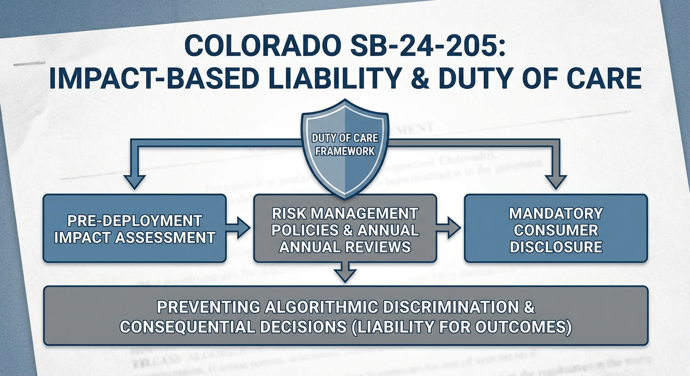
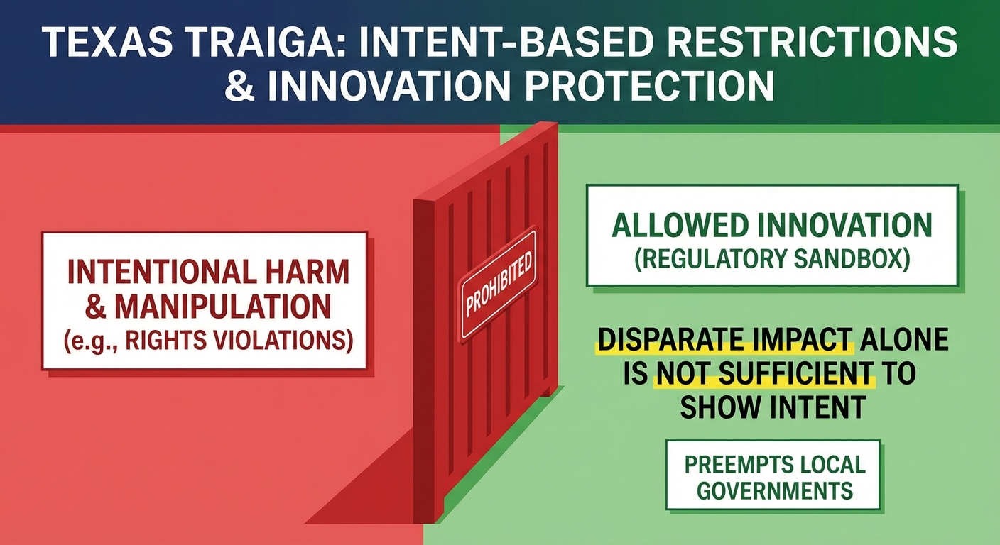
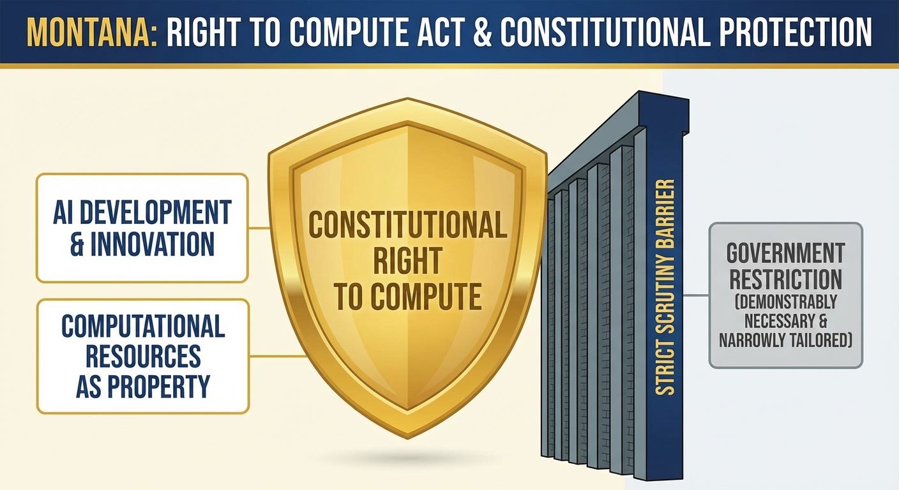

The United States doesn't have a federal AI law. What we have instead is three distinct state-level approaches representing fundamentally different regulatory philosophies. Unfortunately, this is not by design, it's a direct result of federal failure.

## The Federal Void

Congressional efforts to pass comprehensive AI legislation have stalled repeatedly. The closest attempt was President Trump's proposed 10-year moratorium on state AI laws as part of budget reconciliation in 2025. The Senate stripped that provision in July. Without federal action, states filled the vacuum - but they didn't fill it consistently.

The result is regulatory fragmentation along ideological lines. Colorado, Texas, and Montana all passed AI legislation in 2024-2025, but their approaches are fundamentally incompatible. A fourth state, California, nearly joined them with SB 1047 before Governor Newsom vetoed it in September 2024, citing concerns about regulating models based solely on training costs rather than deployment context.

## Three Regulatory Philosophies

Colorado: Impact-Based Liability

Colorado SB-24-205, signed May 2024 (implementation delayed to June 2026), focuses on algorithmic discrimination and consequential decisions via a Duty of Care framework. The law holds developers and deployers liable for discriminatory outcomes regardless of intent. If your AI system produces biased results in employment, housing, or credit decisions, you're responsible - even if you didn't intend that outcome.

This is "Blue Model" regulation: comprehensive risk assessments, impact assessments before deployment, annual reviews, mandatory disclosure to consumers. The emphasis is on preventing harm through procedural requirements and holding companies accountable for results.

Texas: Intent-Based Restrictions

Texas TRAIGA, signed June 2025, takes the opposite approach. The law prohibits AI systems intentionally designed for harmful purposes: manipulation leading to self-harm, constitutional rights violations, unlawful discrimination. But critically, "disparate impact alone is not sufficient to show intent to discriminate."

This is "Red Model" regulation: focus on bad actors with malicious intent, not unintended consequences. The law includes a regulatory sandbox for innovation, explicitly protects smaller companies, and preempts local governments from creating stricter rules. Texas wants to encourage AI development while preventing deliberate misuse.

Montana: Right to Compute

Montana's Right to Compute Act, signed April 2025, goes further. It establishes computational resources as a constitutional right under property and free expression protections. Any government restriction on AI or computational tools must meet strict scrutiny: demonstrably necessary and narrowly tailored to a compelling interest.

This is libertarian regulation: assume AI access is a fundamental right, place the burden of proof on government to justify restrictions. Montana wants to attract tech innovation by protecting developers from overregulation.

## The Compliance Nightmare

If you're deploying AI systems nationally, you now face three incompatible frameworks:

- Colorado: Conduct impact assessments, implement risk management policies, disclose AI use to consumers, prove you're preventing algorithmic discrimination
- Texas: Ensure your system isn't intentionally designed for prohibited uses, document your intent, potentially join the regulatory sandbox
- Montana: Operate freely unless the government can prove a compelling reason to restrict your specific use case

## Why This Matters

The fragmentation creates operational friction for companies and confusion for consumers. A healthcare AI system legal in Montana might require extensive impact assessments in Colorado and face intent documentation requirements in Texas. The same technology, three different compliance regimes.

This is the "High-Compliance Paradox" - federal deregulation paradoxically increases operational friction by unleashing contradictory state-level regulation. Companies that wanted clarity got chaos. States that wanted to protect consumers created a patchwork.

The three states will serve as regulatory laboratories. Colorado tests whether comprehensive procedural requirements prevent harm. Texas tests whether intent-based restrictions strike the right balance. Montana tests whether minimal regulation attracts innovation.

We'll see which approach actually works - assuming we can measure "works" consistently across three incompatible frameworks.

