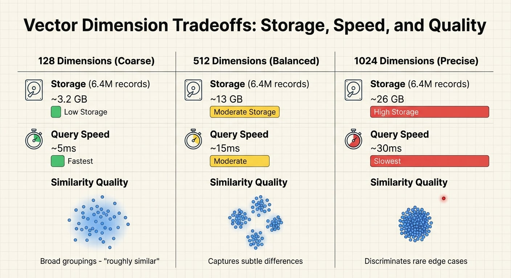

As part of my astronomy work, I have 6.4 million galaxies in a catalog. Each one has about 20 measured properties - age indicators, chemical abundances, velocities, brightness at different wavelengths. Traditional approach: write SQL queries with lots of WHERE clauses to find interesting subsets.

The problem: I don't always know what WHERE clauses I want. I'm looking sometimes for young, actively star-forming galaxies, other times for old, passive ones. Sometimes, I'm just fishing for something interesting. What I want is to be able to point to one interesting object and say "find me more like this one." That's hard to express in SQL.

Vector embeddings solve this.

## The Concept

Instead of querying by explicit feature ranges, you convert each record into a vector - a point in high-dimensional space. Records with similar properties end up near each other. Query by example: give me a record, find its nearest neighbors.

```python
import numpy as np
from sklearn.preprocessing import StandardScaler
from sklearn.neighbors import NearestNeighbors

# Galaxy features: age indicator, emission line strengths, 
# velocity dispersion, stellar mass, local density, etc.
# Each row is one galaxy, each column is one measured property
features = catalog[['dn4000', 'ha_flux', 'oiii_flux', 'mass', 
                    'velocity_disp', 'local_density', 'redshift']].values

# Normalize so all features contribute equally
# Otherwise high-value features (like mass) dominate distance calculations
scaler = StandardScaler()
embeddings = scaler.fit_transform(features)

# Build index for fast nearest-neighbor lookup
# Ball tree handles high dimensions efficiently
index = NearestNeighbors(n_neighbors=50, algorithm='ball_tree')
index.fit(embeddings)

# Query: find 50 galaxies most similar to this interesting one
query_galaxy = embeddings[42]  # Some rare compact starburst
distances, neighbors = index.kneighbors([query_galaxy])
```

That's it. The neighbors share similar properties across all features simultaneously - something AND/OR queries can't express cleanly. The more features you include, the more complex the relationships the embedding captures.

## Why This Works

Traditional query: "Find galaxies where age < 2 Gyr AND emission > 50 AND mass between 9 and 10"

Vector query: "Find galaxies that *feel like* this young, actively star-forming, moderate-mass object"

The difference: the vector query captures correlations. Maybe young galaxies with strong emission usually have low mass - the embedding knows that, and returns objects that match the overall pattern, not just the individual thresholds.

For my catalog, this surfaced scientifically interesting objects that keyword searches missed. Galaxies that weren't tagged as "starburst" but clustered with known starbursts in embedding space. The embedding captured physical similarity that catalog tags didn't.

## Dimension Tradeoffs

How many dimensions should your embeddings have? It depends on what you're optimizing for. In my case w/6.4M galaxies, here are some figures.



128 dimensions: Good for coarse categorization. "Find products in the same general category." Fast and cheap, but loses fine distinctions.

512 dimensions: The practical sweet spot for most applications. Enough capacity to represent subtle feature interactions without exploding storage costs.

1024 dimensions: Worth it when rare object discrimination matters. In my case, distinguishing unusual galaxies from common ones. For most business applications, probably overkill.

The tradeoff is always storage/speed versus retrieval precision. Start with 128 or 256, increase if your similarity results feel too coarse.

## The Pattern Generalizes

Galaxies are just my dataset. The same approach works for:

- Product catalogs: Embed product attributes, find similar items for recommendations
- Customer records: Embed purchase history and demographics, find lookalike segments  
- Documents: Embed content features, retrieve similar documents without keyword matching
- Support tickets: Embed issue descriptions, find similar past tickets with known resolutions

Any dataset with numerical features can become a vector index. Query by example replaces rigid SQL filters with "more like this" similarity search.

## Pre-Compute for Speed

The embedding step is expensive if you're processing millions of records with complex feature transformations. But you only do it once. Store the vectors, rebuild the index as needed, and queries are milliseconds.

This is why my [Analysis Ready Dataset architecture](/p/proxmox-cluster-desi-analysis/) pre-computes embeddings as a core layer. The expensive work happens during data preparation. At query time, similarity search is instant.

---

*For production workloads, consider dedicated vector databases (Pinecone, Weaviate, Milvus) or PostgreSQL with pgvector. They handle indexing, persistence, and scale better than sklearn for large catalogs.*
