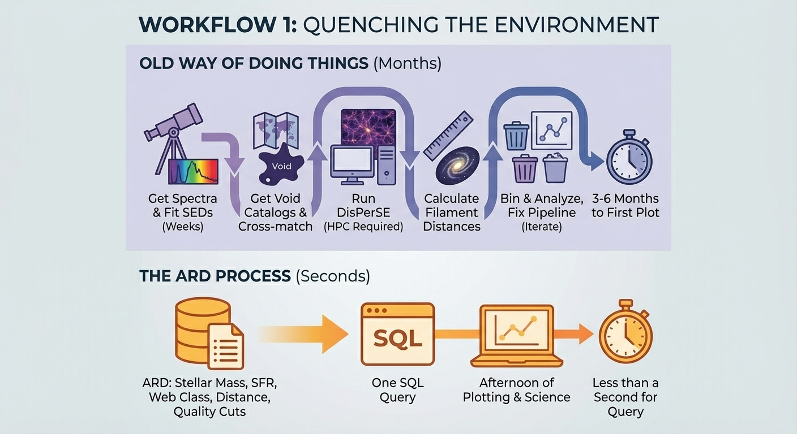
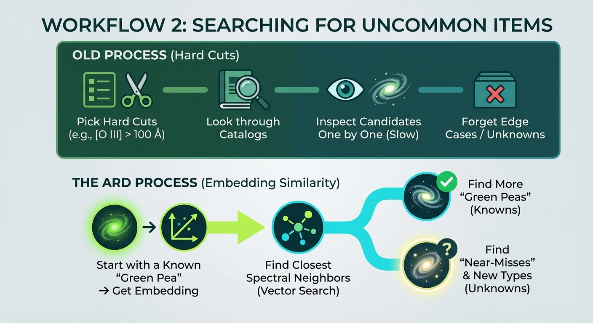
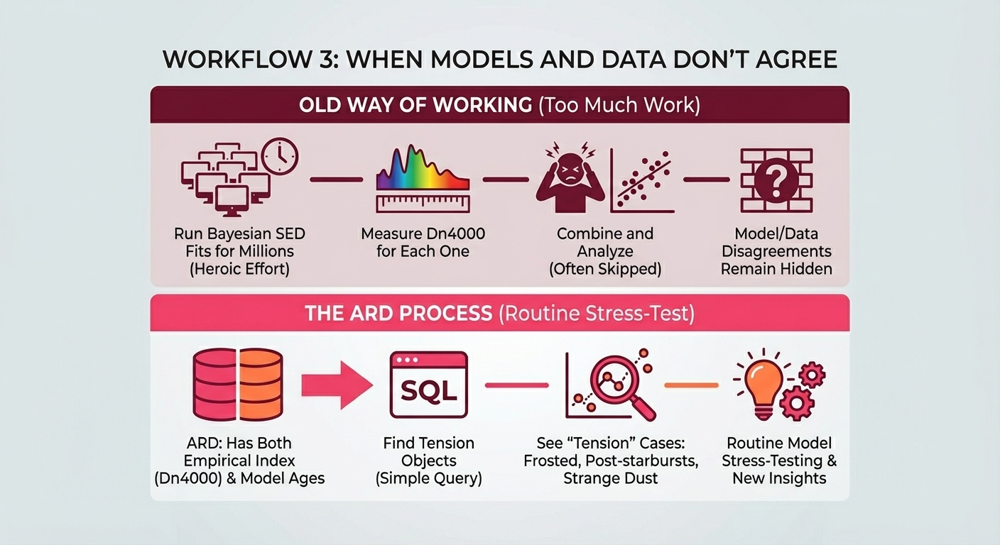

The main reason to use materialized datasets is simple: they work better.

This post goes over some *real* astronomy workflows and the kinds of questions people really ask. It then shows what happens when you start with the DESI Analysis Ready Dataset (ARD) instead of raw files.

---

Workflow 1: Quenching the Environment

The question is: If two galaxies have the same number of stars, do they cool off faster when they are in crowded areas of the Universe?



The Universe on a large scale looks like a web, with long strands of galaxies and gas and big empty spaces in between.  When a galaxy "quenches," it means that it has mostly stopped making new stars.  If galaxies in filaments stop making stars sooner than galaxies of the same mass in voids, it means that environmental factors (like galaxies moving through hot gas, losing their gas, and not getting new fuel) are more important than internal factors (like energy from a central black hole or the galaxy's own structure).

### Old Way of Doing Things

To answer that question in a traditional way, you would do the following:

 1. Get the BGS sample's spectra
    Get the DESI Bright Galaxy Survey spectra, which show a few million nearby galaxies with good spectra.
 2. Use Bagpipes to fit Bayesian SEDs.
    Bagpipes is a Bayesian SED-fitting code that can turn the spectrum of each galaxy into physical quantities like stellar mass, star-formation rate (SFR), and a history of star formation.  This could take weeks of real time by itself.
 3. Include the catalog of cosmic voids
    Get the DESIVAST void catalogs, which are pre-made maps that show where the big low-density areas are in DESI.
 4. Cross-match galaxies to voids. Use your own code to figure out which galaxies are in voids and which are in more dense areas.
 5. Look for filaments (like DisPerSE)
    Use a program like DisPerSE to find the filamentary "skeleton" of the galaxy distribution.  At the DESI scale, this needs a lot more RAM than a normal workstation. You're in the "dedicated HPC box" range.
 6. Find out how far away the filaments are
    Find out how far away the nearest filament is from each galaxy.
 7. Sort by the mass of the stars and the environment
    Put galaxies into groups based on their mass and their environment (void vs filament).
 8. Find out how much quenching there is
    Look at the star-formation rates and quenching timescales in each of those bins.
 9. Do some statistics, go through the process again, and fix the pipeline.
    Fix joins, run jobs that didn't work, and do it all over again.

Depending on how much computing power you have and how many things go wrong, it usually takes 3 to 6 months from "I have an idea" to the first reliable plot.

### The ARD Process

The DESI ARD has already done all of that hard work:

* stellar masses and SFRs from SED fitting *web classification (void, sheet, filament, knot)* distance to filaments * quality cuts

The workflow consists of one SQL query and an afternoon of plotting.

```sql
SELECT Web_Class, WIDTH_BUCKET(logM_p50, 9.0, 11.5, 10) AS mass_bin, AVG(logSFR_p50) AS mean_sfr, STDDEV(logSFR_p50) AS sfr_scatter, COUNT(*) AS n_galaxies FROM desi_ard WHERE logM_p50 BETWEEN 9.0 AND 11.5 AND (logM_p50 - logM_p16) < 0.3 GROUP BY Web_Class, mass_bin ORDER BY Web_Class, mass_bin;
```

On a good laptop, it comes back in less than a second.  You put galaxies into bins based on their mass and environment, and then you make a graph of the mean SFR against mass for each environment.

If void galaxies always have a higher SFR than filament galaxies at the same stellar mass, that's direct proof that the environment is quenching.

---

## Workflow 2: Searching for Uncommon Items

The question is: Can we find more galaxies that act like "Green Pea" compact starbursts that we already know about?



Green Pea galaxies are small galaxies that form a lot of stars and don't have many heavy elements.  Galaxy Zoo volunteers found them, and they are thought to be some of the best nearby examples of the small, wild galaxies we see in the early Universe.

They are rare and useful for science because people use them to learn about how galaxies made and leaked ionizing radiation when the Universe was young.

### Old Process

This is what the standard hunting recipe looks like:

1. Pick hard cuts from the literature
   For example, "equivalent width of [O III] > 100 Å" and limits on line ratios.
2. Look through catalogs for things that meet the cuts.
3. Look at each candidate one at a time.
    This is slow and won't work with more than a few thousand objects.
4. Forget about edge cases.
    Anything that looks like it fits your cuts but is just outside of them is not visible.

You can only find things that you already know how to describe.

The ARD Process

With the ARD, you get embeddings, which are like numerical fingerprints of each spectrum from a model like AstroCLIP.  This embedding space has spectra that "sound alike," meaning they have the same emission-line structure and overall shape.

You can start with one Green Pea that you know and ask, "What else feels like this, even if it doesn't fit my usual cuts?"

1. Get the embedding for a Green Pea you already know

```python
known_pea = ard.get_row(target_id="39633364044752332")
known_pea = pea_vector ["emb_astroclip"]
```

2. Look for its closest spectral neighbors in embedding space.

```python
neighbors = ard.find_similar( vector=pea_vector, k=100, metric="cosine", )
```

3. Look at some of their physical properties for each neighbor:

```python
print( f"{target.TargetID}: " f"logM={target.logM_p50:.2f}, " f"logSFR={target.logSFR_p50:.2f}, " f"Dn4000={target.Dn4000:.2f}" )
```

You don't make binary cuts; instead, you search for similarities in a high-dimensional space that encodes the whole spectrum, including emission lines, continuum shape, and everything else.

This shows:

* regular green peas that pass the usual tests
* near-misses that look the same in the spectrum but are just outside the limits

There might be new types of compact starbursts hiding in those near-misses. These are things that don't fit into any of the current selection boxes, so the community hasn't named them yet.

---

## Workflow 3: When Models and Data Don't Agree

The question is: Where do simple, direct spectral measurements not agree with Bayesian SED fits?



The Dn4000 index is one of the easiest ways to tell how old a galaxy is. It shows "how big is the step in brightness across the 4000 Å break."  Older groups of stars make a stronger break, while younger groups of stars make a weaker one.

You can measure Dn4000 right from the spectrum; it doesn't care what you think your model is.

The age from Bagpipes, on the other hand, comes from fitting synthetic spectra to the data based on a model of how stars form and how much dust there is.  It was made to be model-dependent.  ([bagpipes.readthedocs.io] [2]

Something interesting is going on when those two ages don't agree:

* The model family might not show some behavior, or
* the galaxy might have a star-formation history or dust geometry that is very unusual.

### The Old Way of Working

At the DESI scale, very few people do this from scratch because it takes:

* running Bayesian SED fits for millions of galaxies
* measuring Dn4000 for each one, and then
* putting them all together and looking at them

That's too much work for a project where you just want to see what breaks.

### The ARD Process

The ARD already has both the empirical index and the model ages.  "Find tension objects" is now another question:

-- Galaxies with spectra that look young (low Dn4000) but best-fit ages that are old from Bagpipes

```sql
 SELECT TargetID, Dn4000, age_p50 AS bagpipes_age, logM_p50, Web_Class FROM desi_ard WHERE Dn4000 < 1.3 AND age_p50 >  < 1.3 AND age_p50 >  5.0—old by SED fit (Gyr) AND (logM_p50 - logM_p16) < 0.2 LIMIT 100;
 ```

You can now *see* these tension cases:

* Frosted galaxies are mostly made up of old stars, with a thin layer of young stars on top.
* Post-starbursts are galaxies that just stopped making a lot of new stars.
* Strange dust shapes—dust that the model doesn't show how to arrange.
* Problems with the pipeline—actual problems with the SED fitting or index measurements.

* Every disagreement is either a problem that needs to be fixed or a new type of galaxy that needs to be understood.  The ARD makes this kind of "stress-test the model" work routine instead of heroic.

---

## What Scaffolding Does

In each of the examples above, the ARD serves as scaffolding:

* The hard calculations are already done.
* The joins across catalogs have already been calculated.
* The quality flags are already there.

The real science is what is left:

* making sense of plots
* coming up with and testing hypotheses
* choosing what to look at next * writing the paper

The ARD won't do the research for you.  It gets rid of the infrastructure tax that makes it impossible for the research to even begin.

What do we learn from that?  I really don't know, and that's the point.

The history of democratized astronomy data, from Galaxy Zoo on SDSS images to public releases from SDSS and Gaia, shows that when data is easy to work with, people find new things in places they never thought to look.

Materialized, analysis-ready datasets take that pattern to the next level: they change "in principle, the data is public" to "in practice, you can answer real questions this weekend."

---

*This is the fourth post in a series on Analysis Ready Datasets. Previous posts: [Materialization Matters](/p/materialization-matters-steam-validation/), [The Democratization Thesis](/p/democratization-thesis-desi-ard/), [The Schema Defense](/p/desi-ard-schema-defense/). The DESI ARD is in development at [RadioAstronomy.io](https://radioastronomy.io).*
